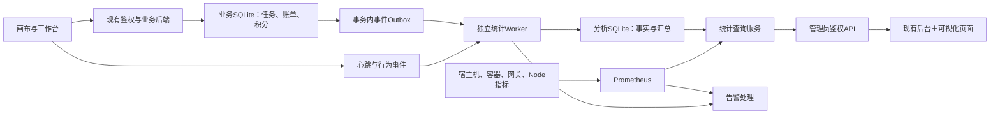

画布后台监控与可视化系统行动方案

建议沿用画布现有管理后台，建设“运行监控、生成成功率、用户分析、模型调度、成品统计、积分对账、管理处置”一体化系统。现有任务、账单与积分流水作为业务事实基础；增加独立的监控采集、业务事件和统计查询能力。

本方案依据本地 infinite-canvas v0.12.14、提交 2f80a02 的代码检查制定。已核实的是源码能力；生产版本、服务器配置、真实数据量与历史覆盖范围尚未核验。本文是实施设计，没有修改业务代码或生产配置。

**一、现有基础与需要补齐的能力**

| 范围 | 已从源码确认 | 实施判断 |
| --- | --- | --- |
| 管理后台 | React、TypeScript、Ant Design；已有用户与权限、内容统计、计费设置、渠道与模型页面 | 在现有后台扩展页面、主题和权限体系 |
| 账户与会话 | 用户信息与权限；SQLite account_sessions 保存当前会话、登录时间和 last_seen_at；SSE 每20秒触碰会话时间 | 可以复用鉴权；新增客户端存活确认与活跃行为，区分打开页面和实际使用 |
| 当前内容统计 | 前端汇总各账户 usage 中的图片、视频、音频、文本与累计积分消耗 | 属于累计账务用量，缺少时间筛选；不能直接当成成品数量 |
| 积分账务 | credit_accounts、credit_postings、billing_ledger、billing_events；支持可用、冻结、结算、退回与幂等 | 沿用现有账务，增加统计投影、对账和异常展示 |
| 图片任务 | image_tasks、排队与执行、上游阶段时间、落盘媒体列表、客户端交付/渲染确认 | 具备较好的任务追踪基础；补统一任务标识和逐次模型调用记录 |
| 图片并发 | IMAGE_TASK_CONCURRENCY 默认2，代码允许1—10；队列目前未暴露统计快照 | 默认配置不代表生产配置或最大承载力；新增队列长度、运行数、上限和等待时间 |
| 视频任务 | 账单关联供应商任务、状态轮询、取回、校验、落盘与重试；有运行租约 | 视频交付 worker 当前同时处理上限2，不能据此推断上游视频生成并发 |
| 服务端存储 | node:sqlite、WAL；文档、媒体索引、同步事件与账务表 | 适合增量接入；大范围统计移到独立进程和分析库 |
| 部署 | Compose 中有前端和后端，已有 /api/health | 增加宿主机、容器、网关和外部探测，细化存活与就绪状态 |

特别需要修正统计解释：非视频代理在收到上游成功响应后即可确认账单，部分流式响应此时还未传输完。因此“账单已完成”“模型响应完整成功”“用户取得成品”必须分别记录。

**二、管理目标与首页核心指标**

后台日常围绕三个结果判断：成功交付了多少成品、用户从提交到获得结果需要多久、积分结算是否准确。在线、资源负荷、并发和模型分布用于解释这些结果。

首页固定展示两组数据：

- 此刻：服务状态、在线用户、活跃用户、执行中任务、排队任务、上游请求并发、异常告警。
- 所选时间段：使用人数、受理任务、成功交付成品、成功率、P95交付时长、已结算积分、退回积分。

“此刻”卡片明确标注快照时间；历史查询时显示该时段峰值、平均值和期末值，不用当前值冒充历史值。

**三、全站统一的统计口径**

| 指标 | 定义与计算 | 关键边界 |
| --- | --- | --- |
| 在线用户 | 有效登录会话且最近90秒收到客户端心跳或存活确认的去重 user_id 数 | 同一用户多个标签页只计1人；SSE连接数独立展示；可见/后台页面分别显示 |
| 活跃用户 | 最近5分钟发生有效交互的去重用户：编辑、提交任务、查看/导出结果等 | 页面自动刷新、轮询、心跳不算活跃；客户端事件仅供行为分析 |
| 区间使用人数 | 所选时间段至少发生一次有效业务行为的去重用户 | 不累加每日去重人数；可另看“提交生成的用户” |
| HTTP并发 | 当前尚未结束的业务HTTP请求数 | 长连接SSE、健康检查和监控请求单列，避免虚高 |
| 任务并发 | 已开始执行、尚未终止的逻辑生成任务数 | 图片、视频、音频、文本分别展示；上游状态不确定的任务单列 |
| 上游请求并发 | 已发起、响应尚未完整结束的供应商请求数 | 分生成、查询、取回；流式请求直到结束/断开才减1 |
| 排队数 | 已受理、尚未获得执行槽位的任务数 | 同时展示最老等待时间、P50/P95等待、有效并发上限 |
| 调用次数 | 一次实际发往模型的生成/推理请求计1次 | 重试、批量拆分分别计调用；查询、下载、模型列表不算生成调用 |
| 任务成功率 | 所选创建时间队列中，完整成功任务 ÷（完整成功＋失败＋部分成功终态任务） | 待完成、取消、未知单列；提示队列尚未成熟，另显示按结束时间的完成量 |
| 调用成功率 | 所选开始时间内，完整成功调用 ÷（完整成功调用＋失败调用） | HTTP 200后断流仍属调用失败；取消、在途、未知单列；显示样本数 |
| 交付时长 | 服务端成品可用时间－任务受理时间 | 分解排队、上游生成、取回、验证/落盘；客户端渲染延迟另列 |
| 成品数量 | 已验证且可取得的独立生成输出数，以 artifact_id 去重 | 一任务生成4张图片＝1任务、4成品；多次插入画布/下载不增加成品数 |
| 当前素材存量 | 当前仍保存的素材数与字节数 | 上传素材与生成成品分开；删除影响存量，不抹去历史产出 |
| 已结算积分 | 统计窗口内发生的确认扣费金额之和 | 按 confirmedAt/结算事件时间归属；冻结不算消费 |
| 净消费 | 已结算积分－已结算后的退款 | 预扣释放、结算差额退回单列，不重复冲减消费 |
| 可用/冻结积分 | 账户指定时点的余额 | 当前余额不能按时间相加；历史余额由期初与分录重建 |

成品按图片、视频、音频、文本/文档、其他作品分类。图片以任务内输出编号形成稳定 artifact_id，哈希用于校验及同一输出重复写入检查，不对全站相同哈希一刀切去重。视频、音频增加总时长；文本统计已明确保存/发布的最终作品，中间回复和Agent内部推理不计入成品。

默认总计覆盖全部实际调用，包括管理员和免费调用；运营表可筛除管理员/测试账户并明确标注。免费调用仍计任务、成品和供应商用量，积分消费可为0。被删除用户以脱敏历史标识保留事实归属，避免总计随账号列表变化。

所有指标采用三种数值状态：有效数据、真实零值、未采集/未知。未知不得填0。用户维度不能分摊出精确宿主机CPU，用户页只展示可归属的任务、请求、积分和存储数据。

**生成成功率：独立指标、独立页面、全维度下钻**

首页将“端到端交付成功率”作为主指标，页面同时展示上游生成成功率和首次成功率。这样能够定位用户失败发生在模型生成阶段，还是图片/视频取回、验证或保存阶段。

| 指标 | 口径 | 用途 |
| --- | --- | --- |
| 上游生成成功率 | 上游最终确认生成成功的逻辑任务 ÷ 上游结果已确定为成功或失败的逻辑任务 | 衡量供应商生成可靠性；上游HTTP接受请求不算生成成功 |
| 端到端交付成功率 | 全部预期输出已成功验证并可取得的任务S ÷（S＋确定失败任务F＋部分成功终态任务P） | 首页“生成成功率”的完整口径；下载/落盘失败导致最终交付失败时进入分母 |
| 首次交付成功率 | 不经生成或交付重试就完整成功的任务 ÷（S＋F＋P） | 识别被自动重试掩盖的问题 |
| 重试挽回率 | 经重试后完整成功的任务 ÷ 已终止且至少发生一次重试的任务 | 衡量重试价值；取消单列，未知与在途不纳入 |
| 输出成功率 | 已成功交付输出数 ÷ 已终止任务的预期输出总数 | 识别一次要4张只拿到3张的部分成功；预期数量未知时不参与并显示覆盖率 |
| 单次模型调用成功率 | 实际成功调用次数 ÷（实际成功调用次数＋失败调用次数） | 衡量每次上游请求稳定性，内部重试会增加调用次数 |
| 提交获交付比例 | 所选创建区间内已完整交付任务 ÷ 已受理任务总数 | 展示当前完成进度；包含等待和未知，明确不能替代成熟成功率 |

任务终态细分成功、部分成功、失败、用户取消；未知、排队和执行中属于未决状态。简化的S/(S+F)仅用于没有部分成功状态的历史数据，并标注旧口径。新后台统一采用包含部分成功的严格交付成功率；单张请求与批量请求不能用不同口径混算。

举例：同一时间段100个受理任务，70完整成功、5部分成功、10失败、5取消、10仍在执行，则严格交付成功率为70/85＝82.35%，另列部分成功5、取消5、在途10；提交获交付比例为70%。这是口径演示，不是系统实测数据。

按创建时间形成任务队列，固定截至asOf观察状态；最近窗口标注“仍有未决任务”，同时支持按结束时间查看完成吞吐。长期未知仍保留并告警，不能为了改善成功率把它改成取消或从任务列表隐藏。管理员测试与外部客户端报告独立筛选。

被系统拒绝、权限不足、积分不足、提交前限流单独统计“提交受理率”和拒绝原因。仅统计已受理任务的生成成功率可能掩盖入口问题，因此两者同页展示。用户显式再次点击生成作为新任务；系统自动重试属于原任务的attempt，不能增加逻辑任务数。

模型归属必须处理回退：默认“请求模型”归属用于按用户选择评估整条链路；“实际执行模型”页以attempt统计单次调用，并记录成品最终由哪个模型交付。发生模型切换时展示回退前后链路，不把一个逻辑任务同时算入多个模型任务合计。模型名与渠道ID组合用于稳定性对比，跨渠道聚合由用户显式选择。

成功率页提供：

- 顶部：交付成功率、首次成功率、上游生成成功率、失败数、部分成功数、取消数、未知/在途数、有效分母与采集覆盖率。
- 趋势：成功率折线与任务样本量并列小图，支持2小时、24小时、7天、30天和自定义；空桶显示无样本，不显示0%或100%。
- 横向比较：用户成功率排行、模型/渠道成功率排行，同时列成功/失败/部分成功数量、耗时P95与重试率。
- 交叉比较：用户×模型、模型×时间、渠道×错误类型矩阵；颜色表示成功率或失败数量，悬浮显示分子、分母和未决量。
- 定位失败：失败阶段与错误原因条形图；点击图表进入保持筛选的任务列表，再进入单任务调用/交付/账单时间线。
- 小样本处理：少于30个已确定任务标记“样本偏少”，支持最低样本筛选，不仅按百分比排序；低样本连续失败仍单独告警。

用户、模型、时间的筛选可组合，例如“某用户＋某模型＋最近24小时＋视频”；总计必须先汇总分子分母再计算。演示：用户A成功1/1、用户B成功1/9，全体成功率是2/10＝20%，不能平均两个百分比得到55.56%。

**四、时间筛选与图表规则**

保留指定的2小时、24小时、7天、30天，增加今天、昨天、自定义区间。最近24小时采用滚动窗口，“今天”按北京时间自然日计算。

| 窗口 | 默认图表粒度 | 自动刷新 | 主要用途 |
| --- | --- | --- | --- |
| 实时/最近15分钟 | 15秒 | 5秒快照；15秒曲线 | 排障、观察突发并发 |
| 最近2小时 | 1分钟 | 15秒 | 近期负荷、排队与错误趋势 |
| 最近24小时 | 5分钟 | 30秒 | 日内使用高峰与模型变化 |
| 最近7天 | 1小时 | 60秒 | 每日时段分布、渠道稳定性 |
| 最近30天 | 6小时；支持切日汇总 | 60秒 | 用户增长、产出、积分消耗 |
| 自定义 | 后端按区间选择，常规每序列不超过720点 | 历史固定区间默认暂停 | 对账、事件复盘 |

时间存储使用UTC，展示按Asia/Shanghai；所有查询统一采用起点包含、终点不包含的区间。同页总览、图表、明细和导出使用相同 from/to/asOf，避免自动刷新导致数字错位。

支持与前一个等长时间段比较。30天对比需要前60天的覆盖；刚上线数据不足时展示覆盖天数，环比为“不可计算”。过去值为0时显示“新增/不可比”，不输出无穷百分比。

请求、任务、积分等流量按桶求和；在线与并发等状态量展示峰值及时间加权平均。P95由原始耗时或可合并直方图计算，不能平均多个P95。缺失采集段留断线并标记，停机不能画成零负荷。

**五、后台页面与可视化设计**

采用左侧导航、顶部固定筛选、内容区图表与明细的布局，延续现有浅色/深色主题。顶部统一包含时间、用户、功能类型、模型、渠道、环境与账户类型；不适用的筛选禁用并说明，例如宿主机负荷不支持按用户筛选。

| 页面 | 核心内容 | 图表与操作 |
| --- | --- | --- |
| 运行总览 | 当前状态＋区间业务指标＋异常摘要 | 在线/活跃折线，任务并发/排队趋势，成品堆叠柱图，错误趋势；点击异常进入对应明细 |
| 服务与负荷 | 宿主机CPU、内存、磁盘剩余、I/O、网络；容器资源、重启；Node事件循环、堆、接口延迟 | 同步时间轴小图、资源阈值线、接口排行；区分宿主机/容器/进程指标及其分母 |
| 在线与使用 | 在线名单、最近活跃、页面/功能、会话状态；区间去重人数 | 在线趋势、小时×星期热力图、功能分布；名单分页，显示最后确认时间 |
| 用户分析 | 注册时间、状态、最后活跃、区间任务/成品、可用/冻结/消费积分、失败率、存储量 | 可排序用户表、前10名＋其他、用户详情页；支持用户多选和全量总计 |
| 模型与渠道 | 请求模型、实际路由模型、渠道、能力、配置版本、调用量、成功率、P50/P95、限流、重试 | 模型调用趋势、渠道对照表、耗时分位图、路由链路；可从模型下钻用户或任务 |
| 生成成功率 | 严格交付、上游生成、首次成功、重试挽回、输出成功率；分母与未决状态 | 用户×模型×时间交叉分析、成功率趋势与样本量、失败原因下钻 |
| 任务与交付 | 排队、生成、取回、校验、落盘、客户端确认；未知/取消/失败 | 实时任务表、单任务阶段时间线；关联全部调用尝试、成品、账单与错误 |
| 成品与存储 | 图片张数、视频条数/秒数、音频数量/秒数、保存文本数、上传量与当前存量 | 分类堆叠柱图、用户/模型产出排行、存储增长；预览单独鉴权、按需加载 |
| 积分与对账 | 期初、授予/调整、冻结、结算、释放、退款、期末；未决账单和差异 | 积分变化瀑布图、消费趋势、用户账表；点击分录进入原始账单事件 |
| 告警与审计 | 当前告警、恢复、确认记录、采集延迟、对账差异、配置操作 | 告警列表与时间轴；显示影响范围、责任人、处理入口和恢复证据 |
| 管理与处置 | 配额、渠道生命周期、待核实任务、账单异常、后台作业和备份 | 从异常直接进入受权限控制的处理流程，保留操作前后状态 |

用户详情页展示该用户的业务总览、使用时间线、模型分布、成品分类、积分流水与异常任务。筛选用户后可再按模型/类别分组；全局汇总直接按相同筛选查询，不把分页表格当前页相加当总计。

所有主要图表支持框选时间、点击图例筛选、查看原始明细和导出CSV；导出保存筛选条件、指标版本、时区、数据截止时间与覆盖状态。超过即时导出限额转后台任务；分页总数与合计均由服务器计算。

首页布局建议：第一行全局筛选，第二行实时状态，第三行区间业务指标，中间两列放“负荷/在线”“并发/排队”，下方放“分类产出”“模型排行”，底部保留异常任务与告警。颜色统一表达成功、进行、等待、失败和未知，状态同时用文字标识。

**六、采集与存储架构**

建议第一版采用现有React/Ant Design＋Apache ECharts，新增独立Node统计进程、分析SQLite、Prometheus及必要的主机/容器采集器。Grafana作为后续运维排障工具可选，用户、成品和积分仍在画布后台统一展示。

监控进程和数据卷独立部署，通过现有后台鉴权后的服务端接口访问。统计查询不在Express业务主线程执行全量JSON解析或长查询，也不在每次刷新时扫描全部用户媒体文件。

业务SQLite开启WAL仍只有一个并发写入者，且当前使用同步数据库接口；独立分析库和Worker用于隔离统计读写开销。参考：[SQLite隔离与并发说明](https://www.sqlite.org/isolation.html)。

Prometheus只存服务、实例、功能、受控模型/渠道等有限维度。user_id、task_id、receipt_id、原始URL进入业务分析库，避免时间序列数量无限增长。参考：[Prometheus指标标签规范](https://prometheus.io/docs/practices/naming/)。

Node采集增加事件循环延迟、进程CPU/内存与请求耗时；事件循环指标可使用原生perf_hooks。参考：[Node性能测量接口](https://nodejs.org/api/perf_hooks.html)。具体运行时和依赖版本在实施前按生产环境锁定。

仅需单机部署时不引入分布式队列；未来出现多后端实例时，再增加共享在线状态与租约存储、全局调度，并将分析库迁至PostgreSQL。触发条件以实际锁等待、处理积压、查询延迟与多机需求判断。

**七、必须补充的数据结构与关联键**

保留现有账务表，新增下列业务事实或只读统计投影：

| 结构 | 记录粒度 | 关键字段 |
| --- | --- | --- |
| telemetry_outbox | 一次已提交业务变化 | event_id、schema_version、occurred_at、entity_type/id、user_id、最小事件载荷 |
| task_facts | 一个逻辑生成任务 | task_id、root_task_id、user_id、kind、source、受理/开始/终止时间、预期/已交付输出数、结果、交付状态、各阶段结果、失败阶段与标准错误码 |
| model_attempts | 一次上游请求尝试 | attempt_id、task_id、request_id、调用目的、requested/actual_model、channel/revision、开始/首字/结束、状态、错误、tokens与来源 |
| artifact_facts | 一个独立成品 | artifact_id、task_id、output_index、user_id、类型、created/available_at、bytes、duration、storage引用、校验状态 |
| presence_events / user_activity | 一次状态变更或节流后的业务行为 | user_id、会话匿名标识、page、动作类别、客户端时间、服务端接收时间、可见状态 |
| user_dimension | 用户维度及历史归属 | user_id、角色/测试标志、注册时间、删除标志；避免存储不必要的身份信息 |
| credit_projection | 原始账务只读投影 | operation_key、receipt_id、user_id、分录类型、金额、发生时间、原始事件引用 |
| metric_rollups | 一个时间桶与固定维度组合 | bucket_start、grain、维度、计数、金额、耗时直方图、覆盖状态、metric_version |
| collection_watermarks | 一个采集源或投影进度 | source、last_event_id、complete_through、backfill状态、错误与延迟 |
| alert_events / audit_events | 一次告警变化或管理操作 | 告警键、严重性、首次/末次发生、确认/恢复；操作人、对象、脱敏差异 |

一条任务贯穿 task_id → attempt_id → artifact_id → receipt_id；Agent多轮调用通过 root_task_id/parent_task_id 关联。既有 generationTaskId、图片task_id、供应商task_id、receipt_id需要显式映射；供应商task_id保留渠道命名空间，不能默认全站唯一。

现有结构未保证所有文本/音频账单都含完整渠道信息，历史缺字段归为“渠道未知”；新调用统一补全，不用当前配置猜历史路由。渠道或定价变更保存快照，历史统计读取当时版本。

索引至少覆盖时间、user_id＋时间、channel/model＋时间、状态＋时间、task_id；事实写入对event_id/attempt_id/artifact_id设唯一约束。统计投影在同一分析事务内更新事实和处理游标，重放不会重复累加。

**八、可靠采集、在线状态与覆盖范围**

关键任务终态、成品确认与积分变化，在现有业务事务内写最小Outbox事件，Worker增量消费；文件成品在原子落盘与校验完成后登记，定期核对“文件已写但事件未记”的中断情况。账务始终以原始账本为准，分析库可重建。

高频HTTP性能数据使用进程指标与有界缓冲；采样或丢弃必须计数并显示覆盖状态。可选埋点失败不阻断生成；关键业务事务失败仍按业务正确性处理，不以“监控降级”为由跳过账务记录。

心跳建议前台30秒一次，后台60秒一次，服务器按90秒有效期计算“近期在线”；浏览器被挂起后可显示离线并在恢复后重新上线。复用SSE推送通道，同时增加客户端ACK/心跳，避免仅由服务器发送心跳就推定浏览器活着。退出、踢下线、禁用即时失效，多标签页按用户去重。

前端只上报动作类别和标识，不上传按键、提示词全文或媒体内容。客户端上报不可作为扣费依据。服务器管理渠道必须完整覆盖；浏览器自配渠道、外部直连、用户本机Codex Agent若未接入事件协议，展示“外部调用未纳管”。本机回传数据标为客户端报告，供应商用量/成本未验证；不能声称统计涵盖全部AI使用。

模型调用埋点覆盖图片生成循环、通用AI代理、视频提交、视频状态轮询、媒体取回，以及服务端可见的Agent LLM。上游查询和下载单列；图片/视频/文本分别采用适合的耗时指标，文本首字延迟不混入图片平均耗时。

实时快照默认5秒推送；曲线15秒采集；事件汇总正常延迟目标不超过60秒。管理员界面显示最后采集时间与延迟，SSE断线回退轮询。后端服务重启时恢复在途任务、游标和租约；不能将失联任务直接计失败或成功。

**九、积分与模型成本的专项处理**

积分用现有百万分之一点整数单位计算。总余额＝可用＋冻结；期末总余额＝期初总余额＋授予/人工净调整－确认消费＋结算后退款。冻结/释放仅在两个余额间移动。可用余额、冻结余额另按各自分录重建。

每日校验三层一致性：账户余额与分录、账单与结算分录、结算任务与交付事实。展示无成品账单、重复结算、长期冻结、已交付未结算、管理员免扣等分类，不用一个总金额掩盖异常。

页面将“积分”“供应商计量”“人民币成本”分开。文本token记录输入/输出/缓存及actual/estimated/unknown来源；图像按张、视频按实际时长或任务量记录。供应商实际费用需接账单或明确价格表并保存生效时间、币种和版本；在接入前成本为“未接入”，不将用户积分直接折算成利润。管理后台标注的“充值”若只是人工加分，统计为积分授予，不推断已收款。

**十、历史回填与数据保留**

先查生产数据最早时间、字段完整率和可关联比例，再确定可回填区间。回填以账务事件、原始任务、媒体明细为优先来源：

- 积分按分录和事件时间回填，期初迁移单独列出；迁移前累计用量不摊到每天。
- 图片按任务media列表与状态证据回填；视频按media-verified、实际时长与落盘证据回填。
- 只有当前media_assets和updated_at时，只能确认当前存量，不能恢复全部历史生成量。
- account_sessions只保存当前会话信息，无法恢复过去30天的在线曲线；现有累积usage也不能还原每日调用轨迹。
- 已删除任务/用户关联资料、未保留的调用失败和外部直连，标为不可恢复或覆盖未知。

历史与实时交界使用来源ID和增量水位去重。先在分析库回填、对账，再发布历史报表。界面每项指标显示有效覆盖起点；不为了补满30天而生成模拟历史。

建议初始保留策略：Prometheus时序数据90天；普通调用与业务行为明细180天；分钟级业务汇总90天、小时/日汇总24个月。任务/成品关联保留至对应产品历史结束，积分账本、审计和未决任务不随普通明细自动删除，另定归档制度。历史细节超过保留期后页面明确降为汇总查询。

Prometheus保留同时设磁盘预算，容量上限可能提前截断时间覆盖，需要持续监测实际最早样本。磁盘预算按实测“活跃序列数×每日采样量×每样本占用”、事件量和索引开销估算；在生产配置核验前不承诺固定容量。分析库每日一致性备份，保留游标/指标版本并演练恢复。

**十一、API与代码落点**

建议新增 /api/admin/observability 命名空间，服务端执行权限、筛选与聚合，不将原始账库或Prometheus查询接口公开给浏览器。

| API | 用途 |
| --- | --- |
| GET /snapshot；GET /stream | 此刻状态、增量推送、采集健康 |
| GET /overview；GET /series | 区间总计与图表，统一时间、指标与筛选 |
| GET /users；GET /users/:id | 用户列表与详情、同条件全量合计 |
| GET /models；GET /channels；GET /success-rates | 模型与渠道统计、成功率多维汇总/交叉矩阵 |
| GET /tasks；GET /tasks/:id | 任务明细与关联调用/成品/账单 |
| GET /artifacts；GET /credits | 成品统计和积分对账 |
| GET /alerts；GET /audit | 告警与审计 |
| POST /exports；GET /exports/:id | 大报表异步导出与状态 |
| POST /api/telemetry/heartbeat；POST /api/telemetry/activity | 已登录客户端状态与节流后的行为上报 |

查询响应统一带 from、to、asOf、timezone、grain、metricVersion、coverage、dataLagSeconds。未知user/model/channel、无权限、超范围查询有明确错误；空结果与采集失败区分。页内钻取、导出使用相同参数；过滤组合必须在后端白名单校验。

实际开发文件安排：

- server/index.mjs：挂载采集与管理员路由；接入图片、代理与会话埋点。
- server/task-queue.mjs：只读队列快照与状态变化钩子，不改调度策略。
- server/video-delivery.mjs：交付阶段与调用观测，不把worker数量当上游并发。
- server/database.mjs、credit-accounting.mjs：最小Outbox、原始账务查询与事件关联。
- 新建 server/observability/：指标、事件定义、Worker、投影、查询与告警逻辑。
- web/src/pages/admin/ 下新增各页面目录；公共筛选及主题按现有规范复用。
- web/src/services/api/ 增加后台统计接口；路由与现有 /admin?tab=... 入口保持可达。
- 新增监控Compose配置与独立持久化卷；同步功能说明、配置说明及运维说明。

**十二、告警、权限与运行保护**

下面是上线初始候选阈值，先观察7天并按模型/渠道基线校准，不视为已验证SLA。

| 告警 | 初始规则 | 处理方向 |
| --- | --- | --- |
| 服务不可达 | 连续3次、每15秒探测失败 | 查容器、网关、进程及数据库；外部独立探测覆盖整机故障 |
| 资源紧张 | CPU持续5分钟超过85%；内存持续5分钟超过85%；磁盘剩余低于15% | 联看事件循环、队列与视频验证阶段，判断扩容或减少并发 |
| 队列积压 | 最老等待超过120秒且持续3分钟 | 按功能/渠道查执行槽位与供应商限流 |
| 模型异常 | 最近10分钟至少20次已结束调用，失败率超过10%；连续429单独告警 | 查渠道、配额、协议与供应商状态 |
| 交付变慢 | 分类P95超过该模型已建立基线的2倍且样本充足 | 分段定位生成、取回、校验或客户端确认 |
| 账务异常 | 账户/分录不平；重复结算；已交付未结算 | 高优先级人工核对；禁止监控自动改账 |
| 未决任务 | 超过该类任务截止时间仍unknown，或needsReview | 查询原任务、确认交付/退款；避免盲目重发付费请求 |
| 数据采集异常 | Worker水位落后超过120秒或指标采集缺失 | 标记后台数据过期；查Worker、磁盘与Outbox积压 |

告警按服务/渠道/错误类型合并，配置持续时间、冷却和恢复通知。优先内置告警中心；飞书或邮件接收人和发送渠道在接入时配置。配置好规则不代表已开通外部通知。

先复用adminOnly，后续拆分查看运行、查看用户、查看积分、导出、修改配置等权限。用户明细和成品预览逐请求鉴权；审计包含查看敏感明细、导出和配置变更。采集器与Prometheus仅内网可达，普通后台不接触API Key、Cookie、完整签名URL或提示词正文。容器采集器所需权限单独控制，不给业务后台开放Docker管理权限。

性能保护包括查询时间上限、分页/点数上限、相同条件缓存、导出并发限制、采集速率限制和磁盘预警。统计服务异常时后台显示不可用，业务沿现有路径运行。Outbox积压在未确认消费前不删除，容量压力通过降采样普通指标、暂停大导出和扩容处理。

**十三、完整后台还需要补充的分析数据与管理能力**

运行数据解释系统是否健康；业务数据解释用户是否获得结果；管理数据支持处理异常、控制资源、追踪责任。除前述指标，完整版本还应补齐以下内容。

| 补充方向 | 必须采集/计算的数据 | 可视化与管理用途 | 优先级 |
| --- | --- | --- | --- |
| 请求入口健康 | 提交意图ID、受理/拒绝、拒绝原因、页面错误、上传失败、登录失败分类 | 发现“任务没进入系统”造成的隐性失败；提交漏斗与错误排行 | 首期 |
| 容量与公平使用 | 各用户/渠道在途数、等待时长、限流次数、全局/用户/渠道限额及生效时间 | 识别单用户占满队列、渠道超额；容量预警与配额管理 | 首期 |
| 用户使用质量 | 注册、新增活跃、首次生成、首次成功交付、最后使用、有效活跃天数 | 新用户激活漏斗、用户分层、停用/恢复账户与权限审查 | 首期基础，留存扩展 |
| 产品使用路径 | 功能入口、创建项目、素材上传、生成、落盘、渲染、保存/导出事件 | 定位哪一步流失；画布、工作台、Agent等入口对比 | 首期关键事件 |
| 生成输入特征 | 模型能力、输出数、尺寸、分辨率、时长、输入媒体数、请求体大小 | 解释特定尺寸/时长失败率，形成参数组合对比；不存提示词正文 | 首期 |
| 浏览器实际体验 | 前端异常率、未处理错误、页面版本、浏览器族、断线重连、渲染ACK、同步耗时 | 查服务端已完成但用户看不到结果的问题；按客户端版本对比 | 首期交付，性能扩展 |
| 账户数据同步 | 同步延迟、失败、冲突、版本差距、文档/媒体缺失、存储超限 | 识别画布保存/跨设备同步异常；区分浏览器缓存和服务器主数据 | 首期 |
| 供应商可靠性 | 429/鉴权/配额/协议错误、超时、错误原因、实际路由、配置版本、外部故障 | 判断换渠道、调并发或修配置；查看受影响用户与任务数 | 首期 |
| 账务与成本 | 长期冻结、结算差异、未决退款、管理员授予、付费用量；供应商真实成本/账单差异 | 对账队列、异常修复、预算；成本缺数据时明确未接入 | 首期账务，供应商成本扩展 |
| 存储与成品完整性 | 当前容量、增长速度、重复保存、孤立文件、损坏/失联媒体、可取回比例 | 清理候选清单、恢复入口与扩容预测；仅生成候选，不默认删除 | 首期 |
| 后台作业与数据质量 | Worker积压、失败/重试、最老事件、水位、回填进度、丢失埋点、对账覆盖率 | 防止“监控页面正常但数据停更”；作业重跑与进度追踪 | 首期 |
| 版本与配置影响 | 前后端版本、部署时间、渠道/价格/配额版本、配置修改者 | 将故障和成功率变化叠加到版本时间线，支持回滚判断 | 首期 |
| 登录与异常使用 | 登录失败率、会话替换、异常请求频率、权限拒绝、越权访问、测试流量 | 风险事件列表、限流、强制退出与账号停用；不依赖精确定位追踪 | 首期 |
| 运维恢复能力 | 最近成功备份、备份校验、恢复演练时间、恢复耗时、网关/证书到期（如启用HTTPS） | 判断能否恢复，设置逾期告警；外部探测识别整机故障 | 首期 |
| 用户留存与支持 | 日/周活跃、首次成功后次日/7日留存、反馈关联任务、问题关闭时长 | 评估用户是否持续获得价值；用户增长和支持问题闭环 | 第二期 |
| 产出质量反馈 | 用户保留/删除/重新生成/评价行为，明确关联任务 | 衡量技术成功后的满意程度；重新生成只作代理信号，不推断用户不满意 | 第二期 |

留存以“首次成功获得成品”为默认分组起点，用户注册留存可独立切换；次日/7日按北京时间自然日定义，尚未达到观察日的用户不放入分母。有效使用时长基于可见页面与有效活动会话区间估算，多标签页重叠去重，不能用登录持续时间替代。

成本效率按类型分别查看“每个成功图片成品成本”“每秒成功视频成本”等，同时纳入失败调用成本。跨类型只显示总成本和类型结构，不用图片张数＋视频秒数形成一个平均单位成本。容量预测采用可解释的短期增长趋势，显示观察区间与假设，不承诺精确耗尽日期。

管理动作需要与指标形成明确对应：

| 异常/管理对象 | 后台动作 | 必要约束与审计 |
| --- | --- | --- |
| 用户 | 权限与角色调整、停用/恢复、强制退出、积分调整 | 复用现有账户机制；服务端鉴权；金额调整填原因、幂等键并记账 |
| 任务 | 查看阶段、查询原任务、重试取回、取消可取消任务、转人工核实 | 区分“查询/取回”与“重新生成”；重新生成可能再付费，需展示费用和权限控制 |
| 渠道与模型 | 暂停接收新任务、调整额度与并发、配置/价格版本管理、恢复历史凭据 | 已在途任务保留原路由与凭据引用；显示变更影响范围 |
| 积分账单 | 核实交付、补充处理依据、释放/退款或确认结算 | 复用现有账务API与幂等规则；先展示可审核的任务和金额，不直接改数据库余额 |
| 存储 | 查看空间占用、导出孤立文件候选、按归档规则处理 | 清理前列明对象/影响/保留期；不能删除未决任务依赖媒体 |
| 告警与作业 | 确认、指派、静默、恢复；重放失败投影、重跑回填 | 静默有期限；重跑幂等；记录操作人和结果 |
| 部署与恢复 | 查看版本、备份状态、恢复记录与运维入口 | 首期呈现状态和操作指引；不开放任意Shell或通用容器控制 |

配额管理属于调度行为变更，应在可观测数据稳定后单独灰度。新增用户/渠道限额不能只在前端拦截，服务器受理与执行时共同检查。多实例下需要共享令牌/槽位或租约；现有单进程队列上限不能当作全站并发限制。

首期完成可靠监控、成功率、统计、权限和人工处置闭环。第二期扩展留存、质量反馈、成本账单对接与自动容量分析。自动改价、自动退款、自动跨渠道重发均需独立设计控制规则，不纳入监控首版的默认动作。

**十四、实施顺序、责任与验收**

| 阶段 | 预计工作量 | 主要负责人 | 交付与完成条件 |
| --- | --- | --- | --- |
| P0 现状与口径冻结 | 2—3人日 | 后端＋运维，产品确认口径 | 核验生产版本/资源/数据时间范围/渠道覆盖，交付指标字典、字段映射、样例查询、页面线框与基线 |
| P1 数据底座 | 4—6人日 | 后端 | Outbox、统一ID、Worker、事实表、成功率状态/分母、幂等重放、历史覆盖报告；抽样任务可串联完整链路 |
| P2 实时运行后台 | 4—5人日 | 前端＋后端＋运维 | 服务负荷、在线、并发、排队、任务详情和实时推送；断线/重启后状态正确 |
| P3 业务与成功率分析 | 6—8人日 | 前端＋后端 | 用户/模型/成品/积分/成功率页面；2小时、24小时、7天、30天；多维交叉、下钻和导出 |
| P4 管理处置闭环 | 5—7人日 | 后端＋前端＋运维 | 异常任务/账单处理入口、配额和渠道状态、审计、同步/存储/作业监控；复用现有管理API |
| P5 对账与上线 | 5—7人日 | 后端＋测试＋运维 | 历史回填、权限/故障/性能验收、备份恢复、灰度和回滚；完成告警规则 |
| P6 运行观察 | 7个自然日 | 运维＋产品 | 校准阈值、核对差异、确认采集开销和数据覆盖；关闭阻塞性问题 |

开发与验证合计约26—36人日，不含生产环境整改、第二期运营扩展、供应商账单对接与额外渠道适配。按1名熟悉系统的全栈人员加运维/测试支持，建议预留7—9周；2名开发并行且依赖及时解决时约5—6周，均包含上线观察时间。估算需P0后按真实数据量和缺失路径修订。

P0/P1完成后即具备可复用数据基础；P2是可用的首个运行监控版本；P3/P4提供完整统计和人工管理闭环；P5/P6完成后正式验收。优先把资源放在统一事实、成功率、账务对账与交付链路，再补高级排行和更多图表。

验收至少覆盖：

1. 同用户多标签页在线计1人，退出/会话替换后失效；浏览器休眠按定义过期，恢复后重新计数。
2. 图片一次任务产4张：任务1、成品4；供应商若拆分调用则显示真实调用次数；重复事件/重试不重复扣费或产出。
3. 视频查询20次：生成提交1次、状态查询20次；视频生成在途量与交付worker运行数分别正确。
4. 流式HTTP 200后断流：调用失败且无完整成品；已结算状态单列并进入对账检查。
5. 预扣150、实际结算60：可用先减150，结算返90，冻结归零，净消费60；结算差额不能再减成负消费。
6. 任意区间、用户、类型组合：卡片、图表、明细、CSV合计一致；无活动用户仍可在用户表出现，零值正确。
7. 24小时精确覆盖24小时；跨日、边界事件、未完成任务、缺失采集和历史不足都有一致结果。
8. 用户去重、P95、并发峰值跨桶合并正确；已删除用户与管理员免费调用不使全站历史总计失真。
9. Worker中断后重放不重复；后台重启恢复队列状态；监控不可用不影响已有生成链路。
10. 权限不能绕过，普通用户无法查询其他用户/管理员接口；导出与API不含凭据或原始敏感内容。
11. 用可控模拟上游压测到目标负荷与2倍短时峰值，比较开启/关闭采集的差异。候选目标：常用统计API P95小于1秒、采集引入的业务延迟增幅低于5%、正常汇总延迟小于60秒；结果以实测验收，不提前声明达标。
12. 演练备份恢复与功能开关回退；关闭新后台后原有积分、生成、画布同步和媒体访问继续可用。需要真实付费生成的回归另按既有授权执行。
13. 成功率演示用例可精确复现：完整成功70、部分成功5、失败10时显示82.35%；多用户合计采用分子分母汇总；内部重试、用户重新生成、模型回退和请求拒绝均按定义归属。
14. 所有管理动作在服务端检查权限，记录目标/原因/前后状态；渠道暂停不破坏旧任务取回，重复账务处理不改变第二次余额，静默告警到期自动恢复。

上线采用新增表/独立数据卷、功能开关、管理员灰度和影子对账。先核验当前生产源码与实际文件，备份业务SQLite及WAL一致性快照、用户媒体和部署配置；分别验证画布、API和网关路由。回滚关闭采集/新页面并恢复应用版本，保留新增事实与账务数据，不回滚已发生的用户交易或覆盖用户媒体。

**附：证据与待核验项**

本次查看的是源码定义，没有查询生产用户、积分金额、在线人数或供应商账单。以下路径提供方案依据：

- [后台现有统计与导航](/Users/hoosland/小浩浩/HHcanvas/infinite-canvas/web/src/pages/admin/index.tsx:270)
- [SQLite表与索引](/Users/hoosland/小浩浩/HHcanvas/infinite-canvas/server/database.mjs:14)
- [积分账户、分录与结算](/Users/hoosland/小浩浩/HHcanvas/infinite-canvas/server/credit-accounting.mjs:21)
- [图片任务执行与媒体落盘](/Users/hoosland/小浩浩/HHcanvas/infinite-canvas/server/index.mjs:990)
- [图片队列](/Users/hoosland/小浩浩/HHcanvas/infinite-canvas/server/task-queue.mjs:1)
- [视频交付与并发控制](/Users/hoosland/小浩浩/HHcanvas/infinite-canvas/server/video-delivery.mjs:146)
- [会话SSE心跳](/Users/hoosland/小浩浩/HHcanvas/infinite-canvas/server/index.mjs:1692)
- [代理计费与流式转发](/Users/hoosland/小浩浩/HHcanvas/infinite-canvas/server/index.mjs:1440)
- [当前部署描述](/Users/hoosland/小浩浩/HHcanvas/infinite-canvas/docker-compose.deploy.yml:1)

P0需要核验的输入包括：实际生产版本、容器限制和宿主机余量、近30/60天数据完整性、启用渠道与外部直连范围、管理员/测试账户分类、保存文本作品的业务入口、告警接收人、数据归档期限。以上事项不妨碍采用本方案开展设计，影响具体排期、容量和统计覆盖承诺。
