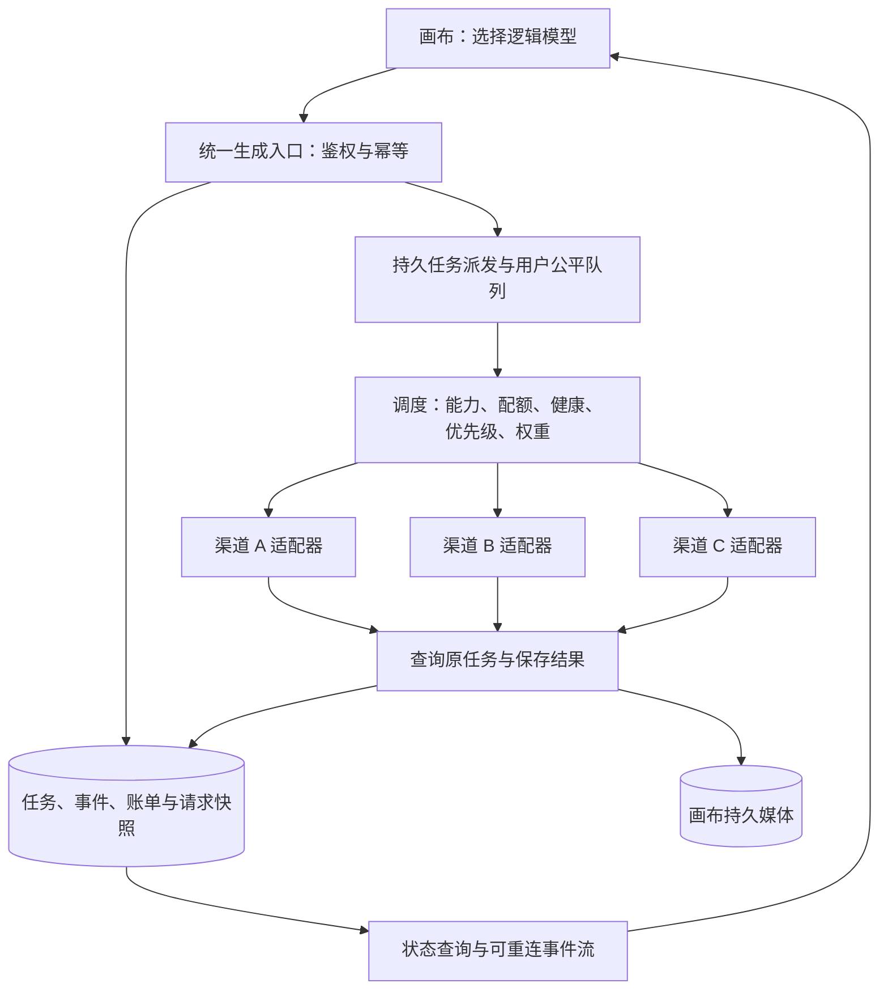

# 画布同模型多渠道调度与服务连续性升级方案

状态：多渠道调度仍为设计评审稿，尚未实施或部署。正文的现有代码盘点保留初稿时基线；后续计费与渠道历史基础已随 v0.12.9 发布，图片并发已随 v0.12.11 提高到 10，并完成四模型 12 图实测，见[当日工作日志](WORK_LOG_2026-09-12.md)和[并发配置](CONCURRENCY_SETTINGS.md)。服务器已部署 New API，画布当前渠道仍直连外部 API；后续可优先验证接入现有内部网关，避免重复部署。初稿的 2 槽/上限 8 和“本地未提交”描述不代表当前生产状态，图片实测也不代表渠道自动切换或高可用已经通过。

## 1. 升级结论

同一个模型有多个后端 API 渠道时，建议由画布服务端提供一个稳定的逻辑模型入口，在内部维护渠道池，按能力、健康、配额和权重选择实际渠道。用户只选一次模型，系统负责分配请求、隔离故障、查询原任务和取回结果。

推荐分两阶段实施：

1. **渠道容错阶段**：在现有 Node 服务端增加逻辑模型、渠道池、按渠道限流和故障切换，复用后台任务、素材存储及账单基础。先解决某个渠道不可用时，新请求还能正常使用的问题。
2. **服务高可用阶段**：将任务执行与网页 API 分离，补齐共享持久状态、可靠任务派发、多个 API/Worker 实例及基础设施高可用，解决画布服务重启、发布和单机故障的问题。

“不断线”应拆成三个可验收目标：入口持续可访问；已受理任务有记录且可恢复；故障后尽可能取得原结果。不能承诺所有渠道同时故障时仍能生成，也不能承诺已经中断的模型输出可由另一渠道逐字无缝续传。

## 2. 已核实的项目基础

以下描述仅对应当前工作目录，不代表生产部署状态。

| 位置 | 已有基础 | 升级需要处理的缺口 |
| --- | --- | --- |
| `web/src/lib/server-ai-config.ts` | 模型选择使用 `channelId::model`，服务端渠道映射为 `/api/ai/<channelId>` | 用户模型与物理渠道耦合，尚无统一模型池 |
| `server/index.mjs` 的 `/api/ai` 代理 | 服务端取密钥并转发；支持 SSE | 请求按指定渠道执行，没有同模型跨渠道调度；浏览器断开通常终止非视频代理请求 |
| `server/index.mjs` 的图片任务 | 返回任务 ID，后台执行、落盘媒体、接收交付回执；重启时将运行中任务标为 `unknown` | 执行时按当前 `channelId` 查配置；部分超时和上游错误直接失败退款；不能直接叠加自动重试 |
| `server/task-queue.mjs` | 单进程队列与任务去重 | 默认图片全局并发为 2，配置上限为 8；没有按渠道、账号配额及用户公平调度 |
| `server/database.mjs` | SQLite WAL，任务、事件、请求去重及账单表 | 持久化不等于多实例可安全执行；还需原子领取、租约、可靠派发与共享状态方案 |
| `server/generation-billing.mjs` | 请求标识、指纹、重复提交结果重放基础 | 当前生成指纹范围包含渠道；统一任务的幂等范围应与渠道选择解耦 |
| `server/channel-history.mjs` | 本地新增渠道版本、凭据引用、历史命名空间 | 图片执行等入口仍需接入；历史凭据文件也应纳入保护和备份 |
| `web/src/services/api/image-task.ts` | 根据原任务查询和恢复，下载已有结果 | `unknown` 当前被归入失败分支；需要独立的待核实展示和恢复操作 |
| `docker-compose.yml` | 前端、后端、Nginx 网关三个容器 | 一个后端和本机持久卷仍是单点；重启策略并非高可用 |
| `nginx.docker.conf`、`nginx.deploy.conf` | 长请求超时和部分 SSE 关闭缓冲配置 | 应按实际路径核对；网关重试不能绕过任务幂等规则 |

当前 `AI_UPSTREAM_TIMEOUT_MS` 默认 1,200,000 毫秒，即 20 分钟。不得为快速切换渠道而把所有图片生成等待时间统一缩短成几十秒。

现有 [视频按秒计费升级方案](VIDEO_SECONDS_BILLING_UPGRADE.md) 和 [生成计费与台账](GENERATION_BILLING.md) 是关联设计。调度升级应复用其任务和账单约束，不能再建立一套相互独立的用户余额。

## 3. 外部调研与技术选择

### 3.1 方案对比

| 方案 | 已读取资料支持的能力 | 在画布中的适用方式及限制 |
| --- | --- | --- |
| Nginx / Envoy | 加权流量分配、连接负载分配；Envoy 支持按被动健康检查摘除异常上游 [S4][S5] | 用于画布 API 实例入口和连接层保护。不能仅靠这一层理解图生图参数、上游任务 ID、重复生成和扣费 |
| LiteLLM Proxy | 同一模型组配置多个部署；权重、配额相关路由、冷却、重试和回退；可用 Redis 共享部分状态 [S1][S2] | 标准协议渠道增多时可作为内部网关试点；画布仍需掌握业务任务、媒体和账单。特殊图片/视频协议必须实测 |
| New API | 项目说明列出渠道加权随机、失败重试、用户模型限流及数据库部署选项 [S3] | 适合需要独立渠道管理平台的场景。能力声明不等于已经验证任意图片/视频路径，需核对所选版本、错误重试及任务绑定 |
| OpenRouter 托管路由 | 支持同模型供应商选择、回退、价格/延迟排序、参数支持过滤等 [S6] | 可作为一个备选渠道或产品设计参考；并非任意现有第三方 API 的通用接入层，且会增加托管依赖 |
| 现有画布服务端扩展 | 已有鉴权、渠道管理、图片后台任务、媒体及计费上下文 | 本项目第一阶段推荐。新增范围集中于模型池与任务编排，标准协议解析、限流和队列优先用成熟库 |

建议第一阶段沿用画布后端：当前难点是图片/视频任务与账单恢复，直接换一个网关并不能完成这些工作。后续若多个应用需要共享大量标准模型渠道，再对 LiteLLM 或 New API 进行独立网关试点，选择其中一种即可。

LiteLLM 文档将“同一模型名下的多个部署负载均衡”和“模型组之间的 fallback”分开说明。此需求优先使用前者；自动改用另一模型不是同模型容灾，不应默认开启。

### 3.2 接入验证必须按实际能力进行

“API 兼容”至少包含：协议路径、鉴权、模型映射、输入格式、流事件、输出格式、错误语义，以及上游任务查询与幂等行为。模型名称相同并不能证明版本、质量、配额或服务来源相同。

本会话提供过一个已验证案例：某配置渠道的图片专用路径返回 503，但 `/responses` 配合图片生成工具能够成功。因此应以“渠道 × 模型 × 操作 × 协议路径”作为能力验证单位，不能因为一个路径失败就认定整个渠道不支持该模型。该案例来自用户提供的验证记录，本轮没有重新实测。

每个候选成员入池前应验证以下样本：

- 文本：非流式、流式、工具调用、结构化输出、长上下文，按需要逐项启用。
- 图片：文生图、参考图、蒙版、多张输入、尺寸、质量、透明背景、URL/base64 返回及大文件取回。
- 视频：创建、原任务查询、取回、取消、时长证据、链接过期与限流行为。
- 故障：错误响应是否明确未受理；是否可能 200 后返回错误事件；提交结果丢失后能否查询或幂等重放。

未验证项默认不支持。不能在切换时默默丢弃参考图、蒙版、工具参数、尺寸或质量设置。

## 4. 目标架构与服务包装



### 4.1 三层身份

| 身份 | 示例 | 职责 |
| --- | --- | --- |
| 逻辑模型 `logicalModelId` | `canvas-image-main` | 用户选择、权限、报价、能力契约；名称不是实际模型版本证明 |
| 渠道成员 `deploymentId` | `image-main-channel-a` | 模型实际名称、API 格式、路径、参数适配、配额和权重 |
| 实际尝试 `attemptId` | 服务端生成的唯一 ID | 绑定渠道版本、凭据命名空间、真实上游任务 ID 和一次执行结果 |

逻辑模型必须有明确的目标模型/版本与能力定义。只有经过等价性验证的成员可进入同池；不同模型、降质量或降分辨率属于用户可见的降级选项，不能悄悄替换。

### 4.2 建议新增的业务接口

以下是拟新增接口，并非当前可调用接口。

| 接口 | 行为 |
| --- | --- |
| `GET /api/models` | 返回用户可用的逻辑模型、能力、报价信息和总体可用状态 |
| `POST /api/generations` | 提交模型、操作、参数和素材引用；必须带 `Idempotency-Key`；持久受理后返回 202 和 `taskId` |
| `GET /api/generations/:taskId` | 查询任务快照、阶段、可恢复状态和结果引用 |
| `GET /api/generations/:taskId/events` | 按事件序号订阅并恢复任务进度；过期游标要求重新取快照 |
| `GET /api/generations/:taskId/result` | 获取已保存的原结果；不重新生成、不再次扣费 |
| `POST /api/generations/:taskId/cancel` | 发起取消；区分取消已确认、仅停止等待、上游状态待核实 |

标准业务请求示例：

```json
{
  "model": "canvas-image-main",
  "operation": "image.edit",
  "input": {
    "prompt": "用户的生成要求",
    "assetIds": ["已上传且属于当前用户的素材ID"]
  },
  "parameters": { "size": "1440x2560", "quality": "high" },
  "context": { "projectId": "当前画布ID", "nodeId": "结果节点ID" }
}
```

尺寸和质量仅作契约示例，实际允许值由模型池验证后的能力决定。服务端必须检查素材与画布归属，不能信任客户端传入的任意 URL 或资源 ID。

`/api/ai/<channelId>` 继续用于明确指定渠道的现有流程和管理员诊断；逻辑入口内部复用相同的鉴权、渠道解析与适配能力，避免通过 HTTP 再调用自己。实施时同步修订 `AGENTS.md` 中仅描述旧渠道入口的规则，明确新增业务入口同样只在服务器保存密钥。

### 4.3 适配器的最小职责

适配器只处理该渠道已经验证的操作：参数校验与转换、发送、错误归类、结果解析，以及渠道实际支持的查询/取消。无需为不支持查询的同步生图接口伪造任务查询能力。

统一返回 `accepted`、`completed`、`definitely_rejected`、`unknown` 等业务结果，保存必要证据。正常 HTTP 状态和业务成功状态分开判断；完整生成结束事件、工具输出和媒体校验完成后才能认定对应阶段成功。

## 5. 数据与一致性设计

### 5.1 建议数据实体

| 实体 | 关键字段或约束 |
| --- | --- |
| `model_pools` | 逻辑模型 ID、目标模型版本、操作能力、价格版本、路由策略版本 |
| `pool_members` | 渠道版本引用、实际模型名、适配器版本、优先级、权重、并发/RPM/TPM、状态 |
| `generation_tasks` | 业务任务 ID、用户、幂等键、规范化请求指纹、模型池版本、价格快照、状态、唯一胜出尝试 |
| `generation_attempts` | 业务任务 ID、尝试序号、渠道版本、请求发送阶段、上游任务 ID、结果状态、错误类型、时间 |
| `generation_events` | 任务 ID、递增序号、事件类型、必要载荷；可通过唯一序号去重 |
| `generation_outbox` | 与任务创建同事务写入的待派发事件；用于失败后补派 |
| 现有账单与媒体 | 绑定业务任务 ID；用户结算唯一性按业务任务建立；各尝试供应商成本单独记录 |

必须在服务端生成 `taskId` 和 `attemptId`。`(userId, idempotencyKey)` 唯一；同键不同请求内容返回 409。指纹包含逻辑模型、操作、规范化参数与按原语义排序的素材内容摘要，不包含后续才选择的物理渠道。不要用大图 base64 充当日志或任务队列载荷。

上游任务 ID 只在其供应商账号命名空间内唯一，不能跨渠道直接比较。所有查询、取消和取回操作必须绑定原尝试的渠道版本及凭据命名空间。密钥轮换后只有确认仍可访问同一任务空间时才能替换查询凭据。

### 5.2 受理事务与恢复

1. 校验权限、输入、模型能力及报价，在必要素材持久化后开始事务。
2. 在同一数据库事务中完成请求幂等占位、创建任务、一次预扣或额度预留、写入派发事件。
3. 事务提交成功后返回 202；派发进程重试发送队列消息，直到确认已派发。
4. Worker 原子领取任务并核对已保存状态，然后记录尝试及发送意图，才允许请求上游。
5. 结果先存入临时持久位置并校验，再提交结果引用、任务状态和对应账单变更。崩溃后扫描并恢复未完成交付。

单机阶段可由数据库任务扫描承担可靠派发，避免立即引入消息系统。多实例阶段采用事务 outbox 配合成熟队列；队列消息仅是执行提示，数据库任务才是事实依据。

网络发送与数据库事务无法合成一个原子操作。即使提前记录发送意图，仍可能在“上游已受理、响应未落库”的窗口崩溃。此时必须进入 `unknown` 并查询或对账，不能认为租约过期就可重新发送。

## 6. 均衡调度策略

### 6.1 第一版选择顺序

1. **能力过滤**：同模型版本、同操作、参数完整支持、用户权限和必要的数据处理约束满足。
2. **状态过滤**：排除禁用、归档、正在排空和熔断中的成员；半开成员只允许受控探测。
3. **容量过滤**：按渠道及共享账号额度检查并发、RPM、TPM、预算；需要原子预留，不能先查再无锁发送。
4. **优先级选择**：从有容量的最高优先级中取成员；高优先级耗尽时才借用下一优先级。
5. **按权重随机分配**：同级成员按权重选择，预留成功后派发；竞争失败则重新筛选。
6. **无可用成员**：未超排队时限且队列有空间时等待；否则返回明确的容量不足或暂不可用状态。

权重控制长期份额，硬配额控制实际容量，两者分别配置。不能用较高权重绕过并发或上游限额。LiteLLM 当前文档也推荐以简单的加权分配作为生产起点 [S1]；第一版无需凭少量样本建立复杂实时评分。

### 6.2 配置例子

以下均为示例数值，不代表现有渠道真实额度；优先级数字越小越先使用。

| 成员 | 优先级 | 权重 | 最大并发 | 共享额度组 | 故障域 |
| --- | ---: | ---: | ---: | --- | --- |
| A | 1 | 5 | 5 | 账号 A | 供应商甲 |
| B | 1 | 3 | 3 | 账号 B | 供应商乙 |
| C | 1 | 2 | 2 | 账号 C | 供应商丙 |

三者都健康且未饱和时，足量请求的期望份额约为 50% / 30% / 20%，不是每十个请求严格按此比例分配。A 被摘除后，新请求在 B/C 之间按 60% / 40% 分配，仍受各自配额限制。A 上的既有任务先按第 7 节判定，不能全部复制到 B/C。

若 C 只作备用，将其优先级改为 2。若 B 和 C 只是同一个上游账号的两个转售入口，应配置共享额度组和共同故障域；它们不构成独立备份。无法核实共同来源时，应在容量规划中保守处理。

### 6.3 队列、公平和容量

- 采用按用户轮转的公平队列，加每用户运行中任务上限；管理员优先也不能令普通用户长期饥饿。
- 分开记录“生成并发”“提交请求速率”“查询请求速率”和“媒体下载并发”。异步任务的并发占用不能在拿到上游任务 ID 时就释放。
- 同一账号共享多个模型时，并发/RPM/TPM 限额必须在账号层汇总；token 用量先预估预留，得到实际用量后调整。
- `unknown` 任务的并发占用不能无限卡死，也不能瞬间全部归零。按已验证的上游最长执行时间、查询证据或人工核实释放，并记录仍可能发生的供应商成本。
- 图片操作按模型、尺寸、质量分别采集耗时；先观察，再考虑按占用率或平滑延迟调整权重，设置变化幅度和最小样本量。

容量粗估可用 Little 定律：平均在途任务数约为每秒到达任务数乘以平均处理秒数。例如每分钟 6 个任务、平均 60 秒，需要约 6 个持续执行槽；再按波动留余量。只有独立渠道的备用容量足够，故障切换后才不会因排队持续增长而失败。

## 7. 故障切换、重试与熔断

### 7.1 是否允许重新提交

| 故障场景 | 系统动作 | 是否自动换渠道生成 |
| --- | --- | --- |
| 本地尚未发送，发现渠道无容量或熔断 | 重新选择合格成员 | 是 |
| DNS/TLS/连接失败，且传输层能证明未发送业务请求 | 记录失败尝试，选择其他成员 | 是 |
| 上游明确拒绝受理，如已核实语义的账号限流或配额耗尽 | 按 `Retry-After` 冷却对应额度组，选择其他成员 | 是，但用户自身的限流不能靠换渠道绕过 |
| 用户参数错误、权限不足、内容被拒绝 | 返回可理解错误；不通过轮换渠道绕过限制 | 否 |
| 渠道凭据失效且明确未受理 | 隔离该凭据范围并告警；用户请求本身有效时选择备用 | 是 |
| 上游 500/502/503/504、读取超时、发送后断连，是否受理不明 | 记录 `unknown`，查询原任务或对账 | 默认否，不能只凭 HTTP 状态码认定未执行 |
| 已取得上游任务 ID | 用原渠道查询、取消或取回 | 否 |
| 已收到部分文本或工具输出后断流 | 保留内容并标记中断；按原能力恢复或由用户发起新的继续操作 | 否，不能拼接成另一渠道的同一次输出 |
| 媒体下载失败、链接过期、浏览器断网 | 重试原结果 GET，必要时在原渠道刷新链接 | 否 |
| 原尝试已确认终止失败且不可能再交付 | 在总预算内建立新尝试，保留原失败证据 | 可，结算仍按同一业务任务 |

错误分类应由渠道适配器根据文档和验收结果给出。特别是流式生图：尚未显示文字或图片，也不代表上游还没受理。对纯文本无工具请求，可以另行定义允许付出重复供应商成本的重试策略，但须显式配置预算；不默认套用于图片、视频或有副作用的工具执行。

### 7.2 重试预算

建议起始规则：同一业务任务最多 3 次上游提交尝试，包含首次；只有上述安全条件成立才消耗下一次尝试。总预算跨重启保存，并覆盖适配器及网关内部可能发生的重试。

- 可重试错误采用指数退避和随机抖动；示例基础间隔 1 秒、上限 15 秒。服务端给出的 `Retry-After` 更长时应尊重它，并检查总截止时间。
- 区分连接超时、首响应等待、流空闲超时、生成总时限、结果下载时限及排队截止时间。它们不能简单相加后无限延长任务。
- 已验证的慢速图片渠道继续使用适合其实际耗时的生成时限；不能仅因首响应慢就发起第二个付费生成。
- 画布负责业务重试预算。引入 LiteLLM/New API 时，要关闭或限制其生成重试，并保证每次实际尝试可观测；无法做到时先排除该路径。
- 第一阶段不启用“同时向两家提交、谁先完成用谁”的竞速请求。这通常会产生两份真实成本，取消也不保证上游停止计费。

本地 `Idempotency-Key` 只保证本系统复用同一任务，不代表上游支持幂等，更不代表两家供应商共享幂等记录。

### 7.3 健康状态与熔断

成员健康状态使用 `healthy → open → half_open → healthy`；管理员停用/排空与健康状态分别保存。

可从以下建议参数起步，后续用真实样本调整：连续 3 次渠道级可用性错误，或最近 60 秒内至少 20 次调用且错误率超过 50%，熔断 30 秒；重复失败延长冷却，最多 5 分钟。半开只放 1 个受控探测，成功后逐步恢复流量。

业务参数错误和用户取消不计入渠道故障率。模型路径错误只影响对应能力成员；401 可能影响同一凭据的全部成员；账号限额冷却应影响共享额度组。故障域信息用于识别相关故障及选择独立备用。

健康探测必须覆盖对应模型和操作，`/health` 或 `/models` 正常只能证明部分连通性。图片/视频探测可能收费，应设置单独预算和低频策略；半开也可使用少量真实合格请求。全部成员熔断时不强行放开所有流量。

## 8. 任务不断、流式恢复与计费

### 8.1 任务状态

```text
queued -> dispatching -> running -> retrieving -> succeeded
                 |          |           |
                 +----------+-----------+-> unknown
                 |          |
                 +----------+-> failed / canceled（仅在有终态证据时）

unknown -> running / retrieving / succeeded / failed / canceled
           以上恢复必须来自原任务查询或核实证据
```

业务任务和渠道尝试分别记录状态。安全切换是业务任务继续等待、旧尝试结束、新尝试开始；不要先把业务任务记为失败、退款，然后重新预扣。

图片/视频先受理再后台执行。刷新、切换网络、SSE 断线或浏览器关闭都只影响订阅；显式点击取消才发出取消请求。收到取消请求不等于上游已取消，无法确认时显示“取消待确认”，并保留查询路径。

### 8.2 流式交付

流连接可重连与模型生成可续接是两回事。

- 在内部任务事件中保存序号及 `attemptId`，浏览器按游标恢复并去重；服务端先保存需要重放的事件，再发送给客户端。
- SSE 每约 15 秒发送心跳，网关关闭缓冲；心跳不是成功证据，也不能突破任务总时限。游标保留窗口过期后返回快照和明确提示。
- Worker 持有上游请求，API 实例负责订阅与重放，浏览器断开后任务可以继续。文本连续性升级也需要这一结构，现有原始透传不会自动具备该能力。
- Worker 丢失上游流后，只能重放已经持久化的内容；只有上游明确支持查询或恢复原响应时，才尝试继续原生成。
- 原始协议兼容接口不能随意插入自定义事件。自定义任务事件放在上述业务事件接口；向兼容客户端透传时遵循对应协议。
- 工具调用参数完整、通过校验并持久记录执行标识后才执行；工具执行也需要独立幂等，重放事件不得重复执行工具。
- 对慢客户端实施背压和缓冲上限，文本分段持久化，媒体只存引用；避免一条 SSE 拖垮整个进程。

### 8.3 一次预扣、一次结算

一个业务任务只有一次用户预扣和一次有效结算，渠道尝试是内部记录。多个失败尝试可能产生真实供应商成本，应单独列入运营成本，不能自动转嫁为用户的多次扣费。

选择备用渠道前冻结用户报价。若备用渠道内部成本更高，系统仅在管理员成本预算内调度；若需要提高用户费用，应在提交前明确报价，不能生成后追加未经确认的涨价。

视频沿用已确定的方案：统一按 15 秒冻结单价预留，取得原任务与可信实际时长、确认成功取回后按实长结算，多扣退回。多渠道调度不改变这一规则；其边界与计量方式按视频升级文档实施。

图片需把“结果已保存”“用户已收到”“用户已计费”分开记录，沿用经确认的交付计费策略。不能仅收到 HTTP 200 就确认成功，不能仅浏览器断开就退款。结果不明时先保留待核实账单；超过核实时限后由明确的退款政策处理，并保证迟到结果不会再次自动扣款。

结算、退款、取消和迟到成功通过数据库条件更新处理，重复通知不能多次改变余额。结果竞争由唯一胜出尝试决定，其他结果隔离保存并记录成本，不再覆盖用户已经取得的结果。

## 9. 画布自身的高可用

### 9.1 第一阶段的明确边界

单个 Node 服务加 SQLite 和本机媒体卷，可以实现渠道故障绕行及部分重启恢复，但整机断电、数据库不可用或进程内上游流丢失仍会影响服务。增加容器副本之前，必须先解决共享任务、配置、额度、文件和事件状态。

不能让多台主机通过网络文件共享直接并发使用同一个 SQLite WAL 数据库，也不能简单复制 `channels.json`、用户余额文件和媒体目录后宣布高可用。当前新增历史凭据保存于 `channel-credentials.json`，同样需要受控管理。

### 9.2 第二阶段推荐拓扑

采用至少两个画布 API 实例、独立 Worker 池、共享 PostgreSQL、Redis/BullMQ 和共享对象存储；入口、数据库、队列与存储也要有相应故障恢复能力。实例应部署于不同故障域，而非只在同一机器上运行两个容器。

| 层 | 必须完成的能力 |
| --- | --- |
| API | 无状态鉴权校验与会话失效共享；从共享数据库读取任务；事件订阅可跨实例恢复 |
| Worker | 原子领取、租约续期、版本令牌限制状态写入、优雅停止与可恢复结果下载 |
| 数据库 | 统一余额及任务事务、备份与恢复演练、主故障切换；业务状态不靠异步 JSON 双写 |
| 队列 | 可靠派发、重投可去重；失去队列时已入库任务可等待，未持久受理请求不能假报成功 |
| 限流 | 跨实例原子配额预留；共享配额不可用时暂停新生成，不让每个实例各自放满额度 |
| 媒体 | 临时对象、校验、持久引用、生命周期回收；已成功结果不依赖某个 Worker 本地磁盘 |
| 网关 | 健康摘除、SSE 配置、连接排空；不对付费 POST 进行未知次数的自动重试 |

BullMQ 官方说明，失去锁的 stalled job 可能回到等待队列再执行 [S7]。所以使用成熟队列仍须在任务业务层判断是否已发送上游。租约和版本令牌能防止旧 Worker 覆盖数据库状态，不能让供应商自动撤销旧请求；禁止把队列重投直接等同于再次调用生成 API。

阶段二涉及现有数据存储改造，应独立实施和验收，不作为一个调度补丁顺带完成。

## 10. 管理界面与可观测性

普通用户模型列表合并为逻辑模型，不再为同模型展示多份供应商选项。生成节点显示“排队中、生成中、保存中、正在恢复、结果待核实、已完成”；自动切换过程保留任务 ID 和提示词，不重复插入节点。

管理员保留物理渠道列表，增加模型池成员、优先级、权重、硬配额、启停/排空、能力验证结果、原渠道查询和故障域设置。提供只计算不发送的路由预览：列出合格成员和排除原因。

每次尝试记录：任务 ID、尝试 ID、模型池/渠道/适配器版本、选择原因、排队时间、连接与首响应时间、生成/下载时间、错误分类、结果状态和成本。禁止记录密钥、完整签名下载 URL、参考图 base64 或默认完整提示词。

监控按逻辑模型与渠道汇总，至少包括成功交付率、请求受理率、P95 排队和生成耗时、限流次数、熔断时间、`unknown` 数量与年龄、切换成功率、恢复下载成功率、重试造成的额外成本。不要把每个任务 ID 放进指标标签；个别任务追踪使用日志或链路系统。

建议初始目标，均为待验证目标：

| 指标 | 建议目标与口径 |
| --- | --- |
| 入口可用性 | 月度 99.9%，面向有效鉴权、合法且在公布额度内的业务请求；合法任务因容量不足被拒仍记为未受理。阶段二才可对外承诺 |
| 受理后可追踪 | 所有返回 202 的任务在进程重启后仍可查到；丢失记录为零容忍验收项 |
| 交付成功率 | 合格受理任务在承诺窗口内成功交付的比例；超过窗口的 `unknown` 和失败必须计入未成功 |
| 账单一致性 | 同一业务任务重复提交、通知和切换均不重复预扣/结算 |
| 安全失败切换 | 在有备用容量时，建议从明确故障判定到备用提交 P95 小于 5 秒；不包含原请求故障检测时间或上游生成耗时 |
| 排空发布 | 停止新任务派发后，既有可恢复任务不丢失；中断的不可恢复上游请求明确进入待核实 |

不能将两个渠道成功率直接相乘来宣传总体可用性。故障相关性、剩余容量、共享网关及数据层故障都会改变结果。99.9% 在 30 天按时间近似对应 43.2 分钟，但此处入口指标应实际按请求口径统计。

## 11. 分阶段实施步骤

各阶段都以“交付物 + 验收门槛”推进，不能跳过任务与账单一致性直接增加重试。

| 阶段 | 实施工作 | 完成标准 |
| --- | --- | --- |
| P0：渠道盘点 | 列出同模型各来源、实际模型/版本、能力、独立性、额度、价格、查询/幂等证据；用管理员路由预览确认 | 至少两个独立且能力等价的成员通过样本验证；不能确认的能力保持关闭 |
| P1：统一模型与任务 | 新增模型池、稳定模型入口、请求快照、业务幂等键；接入现有鉴权/额度和媒体 | 重复提交返回同一个任务；无合格成员有明确状态；用户不再绑定具体渠道 |
| P2：持久尝试与计费 | 建立尝试记录、渠道版本绑定、原子受理、一次预扣结算、派发恢复与 `unknown` | 并发提交和任意故障点恢复不重复扣费，不擅自重发未知任务 |
| P3：调度与容错 | 按用户公平排队、成员权重、硬限额、共享额度组、熔断、受限安全重试 | 统计分配合理；故障成员被隔离；有备用容量时新任务继续生成 |
| P4：画布恢复与管理 | 逻辑模型选择、进度事件、刷新恢复、取消待确认、原结果重取、管理员诊断 | 断网与刷新保留原 taskId；恢复不重复生成/插入节点 |
| P5：第一阶段灰度 | 单个经过验证的图片操作先启用，再扩展编辑与视频；流式文本按能力单独接入 | 第 13 节相关用例通过；风险和未覆盖能力明确记录 |
| P6：多实例高可用 | 数据存储及凭据统一、API/Worker 分离、可靠队列、共享存储、排空发布及基础设施恢复 | 停一个 API/Worker 后服务仍可受理与追踪；数据库/队列故障演练结果满足约定目标 |

建议修改位置：`server/index.mjs` 保留路由接入；调度、尝试与适配职责按现有 `.mjs` 模块风格拆出必要文件；`server/database.mjs` 管理事务与约束；前端统一从 `web/src/services/api/` 接入。所有生成入口，包括画布、工作台、Agent 和插件，都需逐项确认是否纳入逻辑模型，不能只改一个下拉框。

## 12. 升级操作与回滚

本节是后续实施完成后的发布操作清单，本轮没有执行。

### 12.1 升级前备份与基线

1. 核对本地 Git、主分支、生产 `.deployed-commit` 和 `.deployed-manifest.json`，先处理差异。当前未提交计费草稿不能直接成为发布基线。
2. 备份一致性数据库快照、用户数据、渠道配置、历史凭据、图片任务请求/结果、媒体、部署配置及版本清单；密钥备份加密、限制访问，不进入 Git 或公开归档。
3. SQLite 使用一致性备份机制或在停止写入后备份，不能在运行中只复制 `.sqlite` 文件并遗漏 WAL 中的数据。数据库和文件需使用一致快照或暂停相关写入，避免任务引用缺文件。
4. 在隔离环境完成一次恢复，确认账号、余额、待完成任务和素材可读；记录备份位置及恢复耗时。

### 12.2 配置变化

新增配置包括逻辑模型、成员能力、优先级/权重、并发/RPM/TPM、共享额度组、故障域、排队截止时间、尝试总预算、错误分类和熔断参数。真实密钥沿用服务器受控存储，配置示例仅使用引用。

建议新增功能开关 `AI_ROUTING_ENABLED`，默认关闭；它只控制新任务是否进入模型池。关闭后，已受理任务仍按其原版本执行或恢复。此名称属于拟议配置，不是当前已实现环境变量。

`AI_UPSTREAM_TIMEOUT_MS`、`IMAGE_DOWNLOAD_TIMEOUT_MS` 与现有生成并发限制保留明确含义。按渠道并发启用后需说明全局限额与成员限额的共同作用，不能简单把当前全局上限改成无限大。

### 12.3 数据迁移

本次是已有画布服务升级，需要保护仍在运行的任务与账单，不依赖清空数据完成切换。

1. 先增量增加模型池、尝试与必要索引，不立即删除原字段。
2. 管理员明确审核“旧渠道模型 → 逻辑模型”映射；同名不自动合并。新任务使用逻辑模型，历史任务保持原渠道身份。
3. 无法证明历史任务对应哪一个渠道版本或命名空间时，标记待核实，不按当前配置猜测补写。迁移本身不得触发上游生成。
4. 检查任务总量、各状态数量、账户余额、冻结余额、账单金额与媒体引用，生成迁移差异报告。
5. 阶段二数据库迁移单独安排增量复制和最终写入切换；无法证明双写一致性时使用明确的短暂只读/暂停受理窗口，不宣传首次迁移零停机。

### 12.4 发布顺序

1. 完成 P0 至 P5 相应验收，更新版本升级说明、配置文档、变更日志与待测试记录。
2. 从已提交的 Git 树打版本与源码清单；发布前验证全部已授权范围，发布时使用已准备好的产物。
3. 先部署兼容旧入口的新后端与新增数据结构，再更新前端。初始开关关闭，检查登录、画布和原渠道调用。
4. 配置一个模型池，先执行不产生生成请求的路由预览，再用隔离账号完成限额内实测。
5. 按任务 ID 稳定分桶灰度 5% → 25% → 100%；每阶段需覆盖足量任务和完整最长生命周期。影子调度仅计算候选，不向备用渠道重复发送。
6. 多实例发布先摘除旧实例 readiness，再停止领取新任务，保持现有任务查询和事件服务；Worker 排空或转为按原任务恢复。单机阶段应明确发布期间不能保证入口持续可用。
7. 生产运维按项目要求通过普通 SSH 执行；核对 `nginx.deploy.conf` 保留视觉工作台独立路由，校验配置后更新相关网关，不覆盖其他业务入口。
8. 检查模型池流量、失败分类、队列、账单和媒体；记录发布版本、环境、备份、健康检查和未解决事项。

### 12.5 回滚方式

优先关闭新任务的模型池开关或停用异常成员，让新请求回到已验证渠道；现有任务继续用原尝试查询与取回。关闭模型池不能清空队列、取消任务或批量退款。

若需回滚应用，选择能读取新状态的上一兼容版本，保留恢复 Worker 至旧任务结束。数据库先保留新增表/字段，不立即执行破坏性逆迁移。只有在隔离故障、保存切换后的新增账单与任务、核对差异后，才考虑从备份恢复；不能用升级前快照覆盖已经产生的新余额和生成结果。

待所有迁移窗口内任务结束、对账通过后，再规划移除过渡字段与入口。兼容只服务于本次升级窗口，不长期保留无边界的旧路径。

## 13. 验收与故障演练

以下是后续实现必须执行的用例，本轮未执行。先用可控制受理与响应的模拟渠道验证，再在授权额度内做真实样本；统计分布使用足量廉价模拟请求。

| 用例 | 预期结果 |
| --- | --- |
| A/B/C 健康，配置 5:3:2 | 足量样本比例符合预先设定的统计容差，成员硬并发不超限 |
| A 连接建立前失败 | 同任务安全尝试 B/C，一次预扣；A 按规则熔断 |
| A 返回账号级 429 | 尊重冷却，共享额度组受限；用户级 429 不靠换渠道绕过 |
| A 已受理，客户端看见 502 或超时 | 进入 `unknown`；不自动提交 B，不立即按未生成退款 |
| A 返回任务 ID 后宕机 | 继续关联 A 的任务；渠道恢复后查询或取回，不将 ID 发送给 B |
| API 在事务提交后、返回 202 前退出 | 相同幂等键返回原任务；账单与派发记录完整 |
| Worker 在发送前后各故障点退出 | 未发送者可重新派发；无法证明未发送者核实原结果 |
| 重复队列消息、租约过期、旧 Worker 迟到 | 状态写入被版本条件约束；不覆盖胜出结果，不重复结算；未知上游不盲目重发 |
| 同键不同参数；并发提交相同键 | 前者 409，后者得到同一业务任务，无重复预扣 |
| 批量多图部分成功 | 按输出子项保存已完成结果；只对已确认未成功项按策略处理，不能整批再生一次 |
| SSE 中断、浏览器刷新、跨 API 重连 | 从原事件序号恢复，内容去重，原 taskId 与节点关联不变 |
| 上游已输出部分文本后断流 | 已输出内容保留且标为中断，备用渠道文本不冒充原流续接 |
| 返回 200 但结束事件失败、图片无有效结果 | 不能当成功结算；依据实际受理证据进入失败或待核实 |
| 结果下载失败、URL 过期、媒体落盘中重启 | 恢复原结果交付，不新建生成；保存证据与最终引用一致 |
| 取消与完成竞争、重复回调、重复退款 | 唯一终态与账单条件更新，不出现重复扣费或双重退款 |
| 渠道改名、改地址、轮换密钥、归档 | 新请求按新版本，原任务仍可按原版本恢复；无权限凭据进入待处理 |
| B 不支持蒙版、尺寸或工具参数 | B 不进入候选；不静默删参数后继续 |
| 所有渠道故障或备用容量不足 | 有界排队/明确暂不可用，账单按受理与状态处理；服务不无限重试 |
| Redis/数据库/对象存储不可用 | 不能持久受理时明确失败；既有任务保留可恢复状态；不绕过共享限额 |
| 阶段二停止一个 API/Worker 实例 | 入口继续受理，查询可重连；无法恢复的上游流被如实标记 |
| 开关关闭、灰度回滚 | 新请求按回滚策略，存量任务和新账单不丢失 |

## 14. 需要通过盘点补齐的信息

- 同一模型实际有哪些渠道，哪些确实独立，模型版本与能力是否等价。
- 各渠道的并发、RPM/TPM、额度、价格、最长生成时间和可查询/幂等证据。
- 峰值任务量、用户数、常见图片参数、平均及 P95 耗时，备用容量能否承载故障流量。
- 第一阶段纳入哪些操作；其他入口明确保留直连代理，不显示为已支持自动切换。
- `unknown` 的核实责任、最长待处理时间和退款政策；成本上限与用户报价规则。
- 阶段二可用的主机故障域、共享存储、数据库和队列恢复条件，以及可接受的首次迁移窗口。

这些信息不影响先建立统一任务与模型池，但决定哪些渠道可以启用自动切换，以及能对外承诺什么服务水平。

## 15. 调研来源

以下页面本轮已实际读取。它们支持通用机制或产品能力说明，不证明本项目已经集成，也不证明具体第三方渠道一定兼容。本文数值阈值、接口与阶段划分是设计建议。

- [S1：LiteLLM Routing / Load Balancing](https://docs.litellm.ai/docs/routing)：同一模型多个部署、加权分配、路由策略和 Redis 状态支持。
- [S2：LiteLLM Fallbacks / Provider Failover](https://docs.litellm.ai/docs/proxy/reliability)：重试后的模型组回退及测试说明；不能与同模型成员分流混为一谈。
- [S3：New API 项目 README](https://github.com/QuantumNous/new-api/blob/main/README.md)：渠道加权随机、失败重试、限流和部署能力声明；本轮读取对应 main 分支原始文档。
- [S4：NGINX HTTP Load Balancing](https://docs.nginx.com/nginx/admin-guide/load-balancer/http-load-balancer/)：权重、连接负载和入口负载均衡；具体功能注意开源版与 Plus 的差别。
- [S5：Envoy Outlier Detection](https://www.envoyproxy.io/docs/envoy/latest/intro/arch_overview/upstream/outlier)：被动健康检查、异常摘除、冷却与恢复。
- [S6：OpenRouter Provider Selection](https://openrouter.ai/docs/guides/routing/provider-selection)：供应商路由、回退、排序与参数支持过滤。
- [S7：BullMQ Stalled Jobs](https://docs.bullmq.io/guide/workers/stalled-jobs)：Worker 锁丢失后任务可能重新执行，说明业务层幂等与结果不明处理仍是必需。
