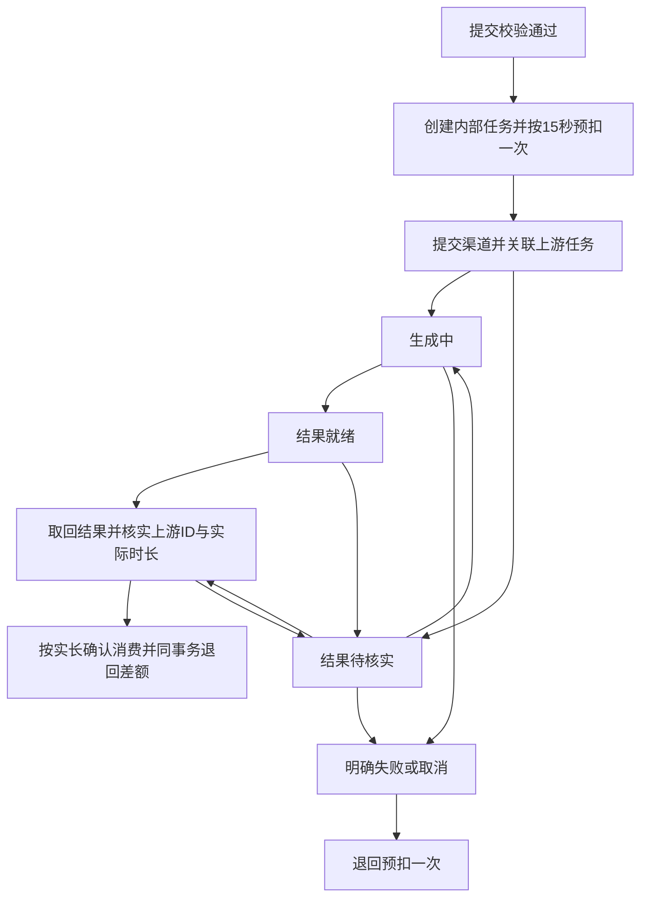

# 视频按秒计费系统升级方案

状态：设计与验收依据，核心流程已实现并完成本地验证，纳入 v0.12.9 发布。“视频统一按 15 秒预扣，取得实际任务 ID 和实际时长后结算，多扣退回”已由用户确定；实际实现范围和限制见[生成计费与台账](GENERATION_BILLING.md)，上线状态以[升级说明](../RELEASE_NOTES_v0.12.9.md)关联的发布回执为准，本文的后续建议不代表已上线能力。

用户已要求按方案实施。实现以统一账务、15 秒预扣和实长结算、可信取回、渠道配置保护及用户明细为当前范围；生产切换和历史补偿仍需按发布与对账步骤执行。

## 1. 结论与建议

现有系统具备读取“请求生成秒数”和部分“视频文件实际时长”的基础，但还不具备完整、可信、可审计的服务端按秒结算能力。

建议分阶段升级：

1. 先完成统一任务、一次预扣、幂等结算和余额台账事务一致性，修复轮询重复计费。
2. 所有纳入本次升级的视频生成任务，不论选择 6 秒、10 秒还是自动时长，均按该任务冻结单价乘以 15 秒预扣一次。15 秒是资金预留时长，不改变用户提交的生成时长。
3. 取得真实上游任务 ID、可信实际视频时长并确认成功取回后，按实际时长计算最终费用，将实耗确认与多扣退回放在同一事务中，不再次全额扣款。
4. 服务端可信测量、差额退回和任务关联是本次按秒上线的必备条件，不再以请求秒数作为过渡收费依据。渠道和自动时长模式必须验证 15 秒预扣边界，具体见第 3.3 节。

定价依据必须显示在生成报价和账单中。“按秒”不能同时含糊指代选择的秒数、文件秒数和等待秒数。

用户已明确：常规说明和用户界面按整数秒描述；目前绝大部分视频模型最多生成 15 秒，因此统一 15 秒预扣作为主流程，超过该范围的少数模式单独处理。后台仍保留原始时长证据；整数秒展示不等于授权改变计费舍入规则。

本文不替管理员决定各模型的实际单价，不将原有点/次数字直接解释为点/秒，不调整历史余额。

## 2. 已核实的系统现状

### 2.1 线上与本地状态分开看

本轮前序服务器只读检查对应线上版本 `v0.12.8`，提交 `c9793aa363cda98f376d8e7ec7b70ceaee72895f`。后续发布前必须重新核对线上版本和文件清单，不能把这次检查结果当作长期不变的状态。

| 项目 | 检查结果 | 对升级的影响 |
| --- | --- | --- |
| 原线上视频价格 | 直接使用单价，没有乘以视频秒数 | 原逻辑是按调用计价，不是按秒 |
| 原线上视频轮询 | 查询也进入扣费流程，已出现重复扣费 | 仅创建任务可预扣，查询和取回必须免费 |
| 生成参数 | 前端发送 `seconds` 或 `duration` | 可建立请求秒数计量，但必须由服务端校验并保存 |
| 画布媒体时长 | 部分视频节点保存 `durationMs` | 可用于研究，覆盖不全且来源是客户端 |
| 视频工作台耗时 | `Date.now() - log.createdAt` 写入 `durationMs` | 是等待耗时，绝不能当作视频秒数汇总 |
| 服务端素材索引 | 有字节数、MIME、哈希，缺少统一时长字段 | 需要服务端媒体测量和任务关联 |
| 本地扣费与台账 | 余额先写 `users.json`，台账另写 SQLite | 两次写入不构成同一事务，存在故障窗口 |
| 本地按秒草稿 | 有单位选择和请求秒数乘价；还按字段同名推断实际秒数并严格比较 | 未完成；字段语义、误差处理、事务和测试均需修订 |

前序线上检查发现，某普通账号当日 3 个视频任务出现 45 笔扣费，共 8700 点；按当时按次配置应为 1000 点，差额 7700 点。该差额是历史对账线索，不能脱离原始记录直接批量退款。同日检查的图片任务未发现相同轮询重复扣费：普通账号 3 个任务对应 3 笔记录，管理员 5 个任务对应 5 笔记录。这不等于所有图片入口已具有可靠的并发去重和故障恢复能力。

### 2.2 实际时长证据

以下是前序直接读取服务器画布记录得到的样本。这里的“实际时长”来自历史浏览器媒体元数据，并非新的服务端测量结果。

| 渠道/模型 | 上游任务 ID | 请求秒数 | 已存媒体时长 |
| --- | --- | ---: | ---: |
| Grok | `d34db2083de7e80fe9092fa8e4765563` | 6 | 6.042 秒 |
| Grok | `06f1934d1665b9e6f3363415f6f932eb` | 10 | 10.042 秒 |
| MiniMax H3 | `440876082975155` | 6 | 6.583 秒 |

另有视频节点没有实际时长字段。不能把缺失值补成 0，也不能认为请求 6 秒的文件必定精确等于 6.000 秒。6.583 秒与请求值不同的具体原因尚未证实，不能预先解释为正常编码误差或生成失败。

服务器宿主机检查未找到 `ffprobe` 命令；后端容器内是否具备该工具还未核验。更关键的是，目前源码没有将服务端视频测量接入计费流程。

### 2.3 代码依据

| 位置 | 当前职责及发现 |
| --- | --- |
| `web/src/services/api/video.ts` | 各渠道创建参数、查询、结果取回；存在标准接口、插件等不同入口 |
| `web/src/lib/seedance-video.ts` | 秒数归一化至 4 至 15，支持 `-1` 自动时长 |
| `web/src/lib/minimax-h3-video.ts` | 秒数归一化至 4 至 15 |
| `web/src/services/file-storage.ts` 的 `readVideoMeta` | 浏览器读取 `video.duration`，超时或读取失败可缺失 |
| `web/src/lib/canvas/canvas-node-factory.ts` 的 `videoMetadata` | 将媒体时长写入画布节点 |
| `web/src/pages/video/index.tsx` | 工作台将生成等待时间保存为 `durationMs` |
| `web/src/lib/billing.ts` | 自带密钥等非服务器代理入口仍有前端通用扣费/退款流程 |
| `server/index.mjs` | 余额变更、代理扣费、图片任务、视频交付确认及管理接口 |
| `server/generation-billing.mjs` | 本地新增的创建识别、请求去重、任务状态解析和按秒草稿 |
| `server/database.mjs` | SQLite 台账、事件、请求去重；尚未统一余额事务 |

这些证据说明本系统能传递时长参数，但不能据此宣称第三方渠道一定按同样的秒数向平台收费。上游成本与平台向用户收取的积分是两套账。

## 3. 计价口径

### 3.1 时间必须分字段

| 字段 | 含义 | 是否可作为收费依据 |
| --- | --- | --- |
| `requestedSeconds` | 服务端归一化并实际发送的生成秒数；自动时长为 null | 生成参数与预计消费参考，不作为最终费用依据 |
| `reservedDurationMs` | 统一固定为 15000 毫秒，不随请求秒数改变 | 预扣数量的唯一来源 |
| `actualDurationMs` | 服务端可信核验的视频播放时长，整数毫秒 | 最终计价依据，缺失不得确认 |
| `billableDurationMs` | 本次按价格版本和规则最终计费的时长 | 按秒账单的唯一结算数量来源 |
| `generationElapsedMs` | 提交至生成结束的墙钟耗时 | 不参与收费 |

另存 `clientReportedDurationMs`、`providerReportedDuration` 和来源信息用于诊断，不能自动覆盖可信实际时长。上游 `duration` 可能只是请求回显、档位或其他含义，需逐渠道验证。

按秒账单的计量数量 `billableSeconds = billableDurationMs / 1000`。面向用户的时长摘要按整数秒显示，非整秒标记为“约 N 秒”，建议四舍五入展示；后台和审计导出保留原始毫秒及计算结果，不能用展示值重新计算金额。按次账单使用 `quantity = 1`，不要伪造 1 秒。参考视频、参考音频时长不计入本次输出秒数；如将来增加输入媒体收费，应建立明确的独立收费项。

### 3.2 已确定：统一 15 秒预扣，按实际时长结算

- 单位：点/秒；预扣依据：固定 15 秒；最终计价依据：实际视频时长。
- 服务端以模型能力校验生成时长、分辨率、音频等参数，冻结最终请求、单价和预扣规则后再校验余额。即使请求只生成 6 秒，可用余额也必须足够支付 15 秒预扣，否则不提交上游。
- 服务端最终请求与用户报价参数必须一致。预扣 15 秒不意味着强制生成 15 秒；参数被归一化改变时，应返回更新报价。
- 每个独立视频输出任务只预扣一次。批量 3 个视频分别按各自单价预扣 15 秒，不能整个批次只预扣一份。
- 取得上游任务 ID 时只关联原预扣账单，不提前结算或释放差额；取得可信实际时长且符合成功取回条件后才最终结算。两个条件到达顺序不限，但必须属于同一任务和同一结果。
- 正常结算必须同时具有内部任务 ID、真实上游任务 ID、有效交付证据及大于 0 的实际时长。任一项缺失时保留预扣、继续取回或核实，不以请求秒数或固定 15 秒代替最终时长。
- 最终费用从原预扣中确认，多扣部分同事务退回可用余额；确认不再次全额扣费，重复确认也不能重复退差额。
- 实际时长不同于请求时长本身不构成失败。普通说明使用 6 秒、10 秒、15 秒等整数示例，后台按冻结的计量规则核算，不因界面展示整数而覆盖原始时长。
- 明显短片、损坏文件、错误结果仍进入待核实，不能因能测出时长就立即收费；模型履约容差应依据渠道约定及真实样本。
- 图片等非视频类型不套用 15 秒预扣规则。尚未迁入的旧按次视频任务按原快照完成，不补扣到 15 秒。

### 3.3 实际时长来源与 15 秒边界

以下为实施建议；统一 15 秒预扣和按实际时长结算已确定，精度及异常超限处置仍按第 12 节列明。

- 建议采用服务端测得的有效视频轨播放时长，精度为毫秒，不默认采用更长音轨的容器总时长。渠道返回时长只有在字段语义与具体输出关联经过验证后才可作为可信来源，不能把请求回显当作实际结果。
- 默认按毫秒累计，不额外向上取整到整秒。任何后续取整规则都需明确展示并冻结到价格版本，不能因上游成本规则改变而自动改变用户收费。
- 固定和自动时长均统一预扣 15 秒，不因模型最多只生成 10 秒而减少预扣，也不按其他模型上限提高预扣。
- 为避免预扣不足，建议本规则仅受理预计输出不超过 15 秒的模式。自动时长须核实渠道输出上限不超过 15 秒；已知可能生成更长视频或上限未知的模式，在边界规则确定前不受理，不能提交后才临时提高预扣。
- 实际时长恰好 15 秒：确认全部预扣，差额为 0。实际时长小于 15 秒：确认实耗并退回差额。
- 意外超过 15 秒的少数结果进入待核实，不影响 15 秒以内模型的常规方案。不能静默追加扣费、产生负余额、篡改实际时长或隐瞒超额。超额由平台承担或另行明确处理，具体商业规则尚待确定；判断使用后台计量值，不使用整数展示值。
- 时长缺失、为 0、非法或检测失败时，不能默认为请求秒数、15 秒或任意正值；应重测并转人工核实。

### 3.4 金额精度与示例

建议内部使用整数微积分：`1 点 = 1,000,000 微积分`。价格输入限制为最多 6 位小数，以十进制解析后转换为整数；中间乘法使用安全的整数运算，API 金额采用十进制字符串，避免浮点误差和整数溢出。

```text
预扣微积分 = 单价微积分每秒 × 15
按秒应付微积分 = roundHalfUp(单价微积分每秒 × 计费毫秒 / 1000)
正常结算退回微积分 = 预扣微积分 - 按秒应付微积分（实际时长不超过 15 秒）
按次应付微积分 = 单价微积分每次 × 次数
```

每个独立输出账单只在最终金额处舍入一次，汇总直接累加已落账金额。显示精度不能改变真实余额。

以下 10 点/秒仅用于说明，不是拟上线价格：

| 场景 | 预扣 | 结算 | 退回 | 可用余额变化（初始 200 点） |
| --- | ---: | ---: | ---: | --- |
| 请求 6 秒，实际 6 秒，ID 与交付已核实 | 150 | 60 | 90 | 200 → 50 → 140 |
| 请求 10 秒，实际 10 秒，ID 与交付已核实 | 150 | 100 | 50 | 200 → 50 → 100 |
| 上述 6 秒任务查询 100 次、确认 3 次 | 仍为 150 | 仍为 60 | 合计仍为 90 | 保持 140 |
| 实际 15 秒，ID 与交付已核实 | 150 | 150 | 0 | 200 → 50 → 50 |
| 请求 6 秒，明确生成失败 | 150 | 0 | 150 | 200 → 50 → 200 |
| 已有上游 ID，但取回失败或实际时长未知 | 150 | 暂不确认 | 0 | 50，预扣中 150 |
| 实际超过 15 秒的异常结果 | 150 | 待核实 | 暂不退差额 | 50，预扣中 150，不自动追加扣费 |

如果初始可用余额只有 100 点，即使请求 6 秒、预计消费 60 点，也因不足 150 点预扣而不受理；前端须明确显示该预扣要求。

管理员免扣仍保存单价、数量、标准应付和豁免原因，实际扣费为 0。真实生成秒数统计仍计入对应任务，不能用免扣金额反推生成量。

## 4. 唯一任务、去重与状态机

### 4.1 标识设计

| 标识 | 产生时机与作用 |
| --- | --- |
| `requestId` | 每次用户明确发起生成时产生；网络重试复用 |
| `generationTaskId` | 服务端预扣前创建的全局唯一任务 ID；整个流程稳定不变 |
| `providerTaskId` | 渠道接受任务后返回；暂时未知允许为空 |
| `receiptId` | 独立账单 ID，一笔预扣关联一个生成输出任务 |
| `eventId` | 每次审计状态变化的唯一 ID |
| `postingId` / `operationKey` | 余额分录 ID / 幂等财务操作键 |

每笔确认消费必须绑定 `generationTaskId`。本次视频规则正常结算还必须关联真实 `providerTaskId` 和可信实际时长；没有上游任务号的视频入口，在完成适配前不进入该收费流程。同步图片等没有上游任务号的入口，记录内部任务号、结果证据及同步来源，不能捏造上游编号。

### 4.2 去重边界

- `(userId, requestId)` 唯一；同标识、同语义参数返回原任务，同标识不同参数返回冲突。
- 请求指纹包含模型、渠道、最终参数和输入文件哈希。multipart 按解析后的语义比较，忽略边界字符串；拒绝关键字段重复或冲突。
- 客户端重复点击在界面侧复用进行中的操作标识；服务器无法仅靠“内容相似”判断不同标识是否属于重复点击。用户明确“重新生成”时创建新任务。
- 每个生成任务最多有一个结算结果；预扣、确认、释放均有唯一操作键，并发时由数据库约束裁决。
- 上游任务去重范围至少包含渠道及上游账号/租户命名空间；同一上游任务不能因为被绑定到不同平台用户而被重复确认。冲突绑定进入核实，不能向另一个用户泄露任务内容。
- 查询、轮询、刷新、下载、回执、页面恢复和服务重启均不得触发新的生成计费。
- 渠道支持幂等键时传递稳定服务端键；不支持时，提交响应丢失不得盲目重发 POST，应先查渠道记录。不能宣称跨外部网络实现了绝对一次执行。
- 第一阶段每个任务限一个输出；批量生成拆为独立子任务与账单，并共享 `batchId`。尚未定义多输出计量的渠道不能悄悄按一条收费。

### 4.3 任务状态与财务状态分离

任务状态表示生成/交付进展；财务状态只有 `reserved`（预扣中）、`settled`（已结算）、`released`（预扣已退回）。待核实是任务/异常状态，资金仍保持 `reserved`，不能把查询失败直接映射为已退款。



已结算记录不能被迟到的失败查询改写成未结算。结算后的服务纠纷、历史多扣等，通过独立补偿分录处理，保留原账单和原因，不重写历史。

## 5. 成功交付与异常处理

### 5.1 建议的可信交付定义

建议将“成功取回”定义为平台服务端已完整取回该任务的视频、验证有效视频轨、保存到该账号可访问的持久媒体存储，建立任务与素材哈希的关联。符合计量规则后可确认消费；浏览器回执用于证明客户端已收到，不作为单独扣费证据。

这样即使用户关页，后台也能恢复取回并结算，用户再次登录可获得原结果。该定义比当前本地“客户端上报非空文件字节数即确认”更可靠，但涉及交付口径，需要在实施前确定。

如果业务要求必须等浏览器下载完成才确认，则应在上述服务端证据之外追加客户端回执，明确长期未回执的处理期限和方式；不得未经约定将超时自动视为交付成功。浏览器报告字节数或时长本身不可证明真实文件，也不能证明用户实际观看。

服务端取回应使用经过渠道适配器验证的结果地址，并控制跳转目标、下载大小、超时和并发，避免任意地址读取。采用成熟的 `ffprobe` 等工具读取本地已保存文件的结构化输出，限定运行时间和资源；只凭 MIME、文件后缀或非零字节数不足以确认有效视频。对截断、轨道缺失等异常不得结算。

### 5.2 错误判定矩阵

| 具体情况 | 资金动作 | 后续处理与证据 |
| --- | --- | --- |
| 参数非法、无权限、余额不足，尚未提交 | 不预扣、不请求上游 | 返回明确错误 |
| 渠道明确拒绝且可确认未创建任务 | 退回预扣一次 | 保存业务错误码及拒绝证据；不能笼统认为所有 4xx 都等于拒绝 |
| 渠道权威状态为失败/取消且结果不可交付 | 退回预扣一次 | 记录原状态、任务号、查询时间及原因 |
| 连接中断、408、429、5xx、响应无法解析 | 保留预扣 | 限频重试查询原任务；不重建任务 |
| 查询 404 | 保留预扣并核实 | 排查路由、渠道、保留期限和任务关联；404 本身不足以证明生成失败 |
| 状态成功但没有结果地址 | 保留预扣 | 再查原任务或渠道结果接口 |
| 签名链接过期、下载 403/404 | 保留预扣 | 刷新原任务结果地址；链接过期不等于任务失败 |
| 用户停止等待、关页、切换账号 | 不改变财务状态 | 后台继续；新账号不能访问旧账号任务 |
| 用户取消请求 | 先保留预扣 | 等渠道确认取消且没有可交付结果；取消请求发送成功不等于任务取消成功 |
| 渠道“expired” | 按渠道语义判断 | 区分生成终止与结果链接/存储过期，不能统一自动退款 |
| 已就绪但文件损坏、时长异常、取回不完整 | 保留预扣并核实 | 重取、核验、留存证据；明确无法履约后退回 |
| 可信文件已取回、真实上游 ID 与实际时长齐全且符合结算规则 | 确认一次并退回差额一次 | 从 15 秒预扣确认实耗，差额入可用余额，不再次全额扣费 |
| 只有上游 ID 或只有实际时长 | 保留预扣 | 继续关联/核实，不提前结算或释放差额 |
| 实际时长超过 15 秒 | 保留预扣并核实 | 不静默追加扣费或将实际时长截为 15 秒 |
| 已结算后再次下载失败或收到迟到失败事件 | 不自动退款 | 恢复素材或经独立补偿流程处理 |

后台恢复任务必须持久化 `nextCheckAt`、尝试次数、最后错误、查询租约，服务重启后继续。尊重渠道 `Retry-After`，按渠道限制退避，不依赖浏览器一直打开。

结果不明不能永久冻结无人处理。建议超过模型约定完成期限即进入管理员待核实队列，首次处理时限建议 24 小时；无可靠渠道期限时由管理员配置。此时限只触发核实，不自动触发扣费或退款。管理员应依据渠道记录、结果可恢复性和履约政策作出有理由的结算或释放。

## 6. 账户、台账与事务设计

### 6.1 统一资金存储

当前 `users.json` 余额与 SQLite 台账分步写入，进程在中间退出可能出现有扣款无日志，或日志与余额不一致。按秒小额、多任务并发会放大此问题，不能仅在原扣费函数外增加一条日志。

建议将积分余额和冻结额统一置于当前 SQLite，用户身份资料可继续沿用既有存储。认证响应、管理充值、生成预扣、退款及通用计费全部读取和更新同一账户数据，`users.json` 中旧余额不能继续作为第二个写入源。

| 表/记录 | 核心职责 |
| --- | --- |
| `credit_accounts` | `userId`、可用微积分、预扣微积分、并发版本 |
| `generation_tasks` | 内部任务、上游关联、状态、恢复调度、结果证据 |
| `billing_ledger` | 一笔任务的报价与结算快照，保留当前台账职责 |
| `billing_events` | 追加写入任务和账单变化依据 |
| `credit_postings` | 追加写入余额/预扣实际变化和唯一操作键 |
| `pricing_versions` | 不可变单价、单位、适用参数、生效时间 |
| `channel_revisions` | 任务引用的不可变渠道非敏感配置版本、上游命名空间与凭据引用；生命周期规则见第 7.3 节 |
| `generation_requests` | 请求幂等及响应恢复，沿用已有结构完善关联 |

采用 SQLite 事务原子提交“账户变化 + 分录 + 账单状态 + 审计事件 + 任务变更”，数据库异常时整体回滚。网络调用和文件下载不能放在数据库写事务中。

服务端先持久化可恢复提交意图，再执行外部请求。提交工作任务用租约避免并发执行；在“上游已接收、本地尚未保存结果”的故障窗口中进入待核实。计费数据库应评估并启用符合资金持久化要求的同步设置；当前 `synchronous = NORMAL` 不能直接当作断电零丢失保证。

文件先写临时文件并校验、原子落盘，再事务性关联任务和账单。文件已落盘但数据库尚未提交的崩溃，可按稳定任务存储键和哈希恢复；不能先确认收费再尝试保存视频。

### 6.2 资金变化与不变量

```text
视频预扣 P = 冻结的每秒单价 × 15（按金额精度转换）。
预扣 P：可用 -= P；预扣 += P；累计已消费不变。
结算 C（0 <= C <= P）：预扣 -= P；可用 += P - C；累计已消费 += C。
失败释放：预扣 -= P；可用 += P；累计已消费不变。
```

必须满足：

- 可用和预扣均不为负；并发两个任务不能花费同一份可用余额。
- 单任务 `已确认金额 + 已释放金额 = 原预扣金额`，完成结算或释放后不再占预扣。
- 每个任务最多一笔原始结算，重复 API、回调、后台恢复只能读取同一结果。
- 账户可用额和预扣额分别等于期初对应余额加相关分录增减；充值、人工调整、补偿也纳入分录，确保整体可对账。
- 台账中的预扣不计入“已消费”，用户能分别看到可用、预扣中、已消费和已退回。
- 退款、确认事件不能与余额写入脱节。数据库唯一约束和状态条件更新共同保证，而非仅用进程内布尔值判断。

### 6.3 必须保存的审计字段

| 分组 | 字段 |
| --- | --- |
| 身份与关联 | 账单 ID、内部任务 ID、请求 ID、上游任务 ID、用户 ID、渠道及上游命名空间、批次 ID（如有） |
| 渠道追溯 | 渠道配置版本、原始上游模型 ID、协议适配器版本、凭据引用 ID、经核实的路由/凭据变更事件；不包含密钥值 |
| 时间 | 创建、提交、上游完成、取回、确认、退款、最近核实时间；UTC 保存，界面按时区展示 |
| 类型与模型 | 图片/视频/音频/文本、生成模式、模型原始 ID及显示名、分辨率、音频选项等实际计价参数 |
| 定价 | 价格版本、单位、计价依据、单价、时长步长和舍入规则、标准应付、豁免/优惠原因 |
| 数量与金额 | 请求秒数、预扣毫秒（视频固定 15000）、实际毫秒、计费毫秒或按次数量、预扣额、已确认额、已退回额；退回原因区分结算差额与任务失败 |
| 交付证据 | 素材 ID、文件哈希、字节数、视频轨时长、测量来源和工具版本、验证时间、客户端回执时间 |
| 状态与依据 | 任务状态、资金状态、错误类别/代码、核实结论、相关证据引用 |
| 事件日志 | 唯一事件 ID、操作键、操作者/系统组件、前后状态、资金增减、操作理由、关联补偿单号 |

单价与全部定价参数在预扣时整体冻结，后续管理员调价不改变进行中任务。不能先读取单位、等待异步解析后再读取已被修改的价格。

事件和资金分录只追加不覆盖；普通用户只读自己的记录，管理员调整通过明确接口写入新事件。数据库内“只追加”不是对数据库管理员的防篡改保证，需保留受访问控制的异机审计备份以支持追查。日志不记录 API Key、完整签名下载 URL 或未经脱敏的请求正文。

## 7. 渠道与图片适配

### 7.1 视频渠道验证表

以下范围来自当前客户端代码，不等价于渠道对所有模型的真实承诺。启用前补齐渠道文档/管理台记录及已有任务响应样本，避免为研究直接发起付费生成。

| 入口 | 当前提交时长字段 | 上线前必查 |
| --- | --- | --- |
| OpenAI 兼容视频接口 | JSON 或 multipart `seconds` | 各模型允许秒数、默认值、响应字段是否回显、创建与内容路由 |
| Seedance | `seconds` 或 `duration`；允许 `-1` 自动 | 渠道差异、自动时长上限、结果时长语义、参考媒体是否影响价格 |
| Grok V2 | `duration` | 正确状态与任务 ID 路径、时长范围、结果字段 |
| Grok 兼容接口 | `duration` | 与 V2 的计量差异、模型解析和路由归属 |
| MiniMax H3 | `duration`；客户端限制 4 至 15 | 实际档位、768P/2K 定价差异、轮询限频和视频轨时长 |
| 自定义插件、自带密钥 | 插件/前端自定义 | 是否由平台收费、是否有可信服务端任务和结果证据 |

适配器输出统一的请求时长、上游任务号、权威状态、结果位置和“语义已验证的时长信息”。没有经过验证的 `duration` 字段仅留作原始诊断值。

第一阶段仅对已完成服务端适配的渠道和模型开放按秒。插件、自带密钥等不能因通用价格默认值改变而误切换到按秒；其平台服务费政策另行标记。在这些入口迁入统一任务流程前，禁止通过前端自报秒数调用通用扣费接口实现按秒收费。

### 7.2 图片是否有同类风险

已检查的线上样本没有视频轮询那样的重复扣费，但图片同样需要任务幂等、余额事务、成功证据和退款保护。图片继续按现有配置单位收费，不能乘以视频秒数。

- 图片后台任务、同步生图、Gemini、插件入口分别盘点，禁止笼统宣称已全部覆盖。
- 图片成功以服务器保存有效结果为依据；客户端取回失败应重取原结果，不能自动再生成或再次扣费。
- 同步失败也要区分明确拒绝与提交结果未知，不能靠前端异常直接退款已经完成的收费任务。
- 第一阶段每个计费输出独立任务。一次请求返回多张时，必须预先定义按请求还是按张及部分成功结算规则；在未完成适配前不改变原模型计费含义。
- 图片与视频共用账务核心，分别使用各自任务状态与结果验证逻辑。

### 7.3 未完成任务的渠道配置保护

#### 当前缺口与目标

已核对 `server/index.mjs` 的渠道管理接口：`PATCH /api/admin/channels/:id` 直接覆盖地址、密钥、协议和模型列表；`DELETE /api/admin/channels/:id` 直接移除渠道，仅清理默认模型引用，没有检查未完成任务。前端也会从当前渠道列表解析请求配置。这意味着旧任务的原始查询条件可能在管理员操作后消失。

目标规则是：**新配置服务新任务，原任务始终按创建时的渠道身份和协议恢复；修改、下架、密钥轮换不能隐式改变旧任务的归属。** 查询、取回、取消与核实由服务器根据内部任务记录解析，不依赖浏览器当前选择的模型或默认渠道。

#### 任务创建时固定的关联

| 字段 | 保存内容与约束 |
| --- | --- |
| `channelId` / `channelRevisionId` | 稳定渠道 ID及不可变配置版本；ID 不复用 |
| `providerNamespaceId` | 实际上游账号/租户及任务命名空间的内部标识，不用 API Key 本身充当身份 |
| `providerModelId` | 实际提交的上游模型 ID，显示名改动不得改变该值 |
| `baseUrl` / `apiFormat` / `adapterVersion` | 已校验的原请求端点、协议与适配器版本，由配置版本提供 |
| `credentialRef` | 受保护凭据存储的引用 ID，不把 API Key 复制进任务、台账、普通日志或前端 |
| `providerTaskId` | 上游返回后关联；与命名空间共同确定唯一上游任务 |
| `pricingVersionId` | 独立冻结的计价版本，渠道变更不能触发旧任务重新报价 |

创建任务、绑定渠道版本与预扣应在同一事务中完成。渠道是否允许新建、配置版本是否有效必须在该事务内校验，防止“先查无任务，再删渠道，同时新任务刚好预扣”的竞争。建议渠道非敏感版本和生命周期状态与任务关联一起存入 SQLite，不能依靠 `channels.json` 与数据库分步写入模拟原子保护。

渠道配置引用和任务恢复版本必须随备份一起保留。更新适配器时，保留进行中任务需要的解析能力或先验证兼容迁移，不能只保存版本号却删除对应实现。

#### 管理操作规则

| 管理操作 | 新任务 | 已存在任务 |
| --- | --- | --- |
| 修改显示名称、排序 | 使用新展示信息 | 不影响路由；账单保留原快照便于审计 |
| 修改价格 | 使用新报价版本 | 保持原单价与 15 秒预扣快照 |
| 修改地址、协议、模型映射 | 创建新的不可变配置版本 | 默认继续使用旧版本，不从最新配置重新解析 |
| 下架模型或停止渠道新生成 | 拒绝新建任务 | 仍允许后台查询、取回、取消、核实及结算 |
| 归档渠道 | 不再出现在生成选项 | 管理员可查看原任务，后台保留恢复所需关联 |
| 请求彻底删除配置 | 有依赖则拒绝，并返回待处理数量 | 任务和账单关联不得被清空或级联删除 |

删除检查不能只看“生成中”或“余额预扣中”。至少涵盖排队、提交结果不明、已提交、生成中、结果就绪但未持久交付、取回中、待核实、取消未确认，以及已退款但上游仍可能继续执行的任务。退款并不自动证明上游任务已经停止。

正常运营默认使用“停止新生成/归档”，不物理删除有历史引用的配置版本。仅当不存在执行或取回依赖时，才可移除运行凭据；非敏感版本、任务身份和审计引用保留。已完成任务如果依赖外部链接重新取回，也属于取回依赖；结果已存本平台则应从本平台恢复。

#### 密钥轮换与紧急吊销

- 同一上游账号更换密钥：新增受保护的凭据版本，验证新密钥可查询原账号任务后，显式更新恢复凭据引用并记录操作事件；不改变原任务 ID、原账号命名空间、价格或预扣。
- 验证使用渠道身份接口或已有任务只读查询，不为验证发起新生成。原凭据仍有效时，不在验证新凭据前提前清除它。
- 更换为另一个上游账号：必须建立新的命名空间和配置版本，只用于新任务；不能凭渠道显示名称相同而让新账号查询旧账号任务。
- 密钥泄露或安全事件：允许立即吊销、禁用相关外部调用，不受“有未完成任务不能删凭据”限制。保留非敏感关联，任务转为凭据不可用待恢复；余额继续按真实履约结果处理，不能因 401/403 自动退款或另建任务。
- 若旧凭据已被吊销且新凭据无法访问原任务，进入渠道人工对账流程。程序不能恢复上游已取消的授权，也不能保证凭任务 ID 就一定能取回。
- 密钥始终存放在受访问控制的服务端凭据存储中；账单只记录引用 ID及轮换理由，不记录密钥原值、旧新对比或可用于认证的内容。

#### 渠道故障、地址迁移与恢复

原端点暂时故障时，对原任务限频重试并显示具体原因，不切到另一个渠道重新生成。供应商迁移域名时，只有验证新端点仍属于同一上游账号/任务空间且能查询原任务后，才建立显式恢复路由关联；保留原版本、目标版本、依据、操作者和时间。

原始配置快照不可被恢复操作覆盖；恢复使用的路由或凭据引用单独记录。新端点继续接受地址和访问范围校验，不能因是管理员填写就无条件发送旧密钥。除上述有证据的恢复外，不进行跨账号、跨供应商自动替换。

管理员的待核实列表应区分 `credential_unavailable`（凭据不可用）、`endpoint_unavailable`（端点不可用）、`task_lookup_failed`（任务查询失败）与生成失败。提供恢复原任务、查看依赖和归档操作；这些操作本身不产生新预扣。

当新凭据或端点恢复后，后台从原任务状态继续，使用同一预扣账单完成实长结算和差额退回。最终无法恢复则按履约核实及退款流程处理，保留无法交付的证据。

## 8. 接口与界面

### 8.1 接口契约

尽量扩展已有接口，避免并行维护另一套扣费入口。以下为目标契约，新增路由名称在实施时结合现有结构确定。

| 接口职责 | 约束 |
| --- | --- |
| 服务端报价 | 返回价格版本、模型参数、实际时长计价依据、单价、请求秒数、预计消费、固定 15 秒预扣时长及预扣金额、报价有效期；预计消费不等于最终消费 |
| 创建生成任务 | 必须带稳定请求标识和已展示报价；事务校验/预扣后返回内部任务号、账单号和当前状态 |
| 查询/取回任务 | 只读或推进任务处理，不预扣；账户可用额为 0 也可取回自己的任务 |
| 视频 `ack` | 仅作为交付回执；拒绝凭客户端金额、时长、字节数字段直接结算 |
| `delivery-error` | 记录原因并安排核实，不直接改变资金 |
| `/api/billing/ledger` 与账单事件 | 服务端强制按登录用户过滤，外部用户参数不能扩大范围 |
| `/api/admin/billing-ledger` | 管理员筛选、汇总、查看证据及待核实任务 |
| 管理调整/退款 | 必须有唯一操作键、理由、原任务/账单关联及操作者；重复调用不重复入账 |

报价过期或参数/价格变化时返回可识别的重新报价结果，不先扣费。已预扣的重试始终返回原订单快照，不能要求用户按新价支付。数据库暂时不可用时暂停新增预扣，不允许绕过台账继续收款。

通用 `/api/billing/charge`、退款以及管理充值入口要统一到账务服务，并限制能力边界，避免绕过任务证明、计价校验和终态约束。

### 8.2 普通用户积分明细

沿用本地已增加的账号菜单、“我的账号”入口和 `/account/billing`，补齐：

- 概览：可用积分、预扣中积分、所选期间已消费与已退回，按任务计数和计费秒数分别显示。
- 明细：时间、生成类型、模型、任务 ID、单价及单位、计费时长、预扣、确认、退回、当前状态。
- 详情：完整账单号和任务号、请求/预扣/实际/计费时长、价格版本、结算退差额与失败退回的原因、关键状态时间线、可理解的异常原因。
- 筛选：时间范围、类型、模型、任务/账单号、状态；分页和导出沿用同一权限过滤及口径。
- 预扣行与确认事件不得被界面相加成两次消费。详情中的事件不重复计入总额。
- 账号切换清空上一账号缓存和进行中的明细请求；他人账单详情返回不可访问，不能泄露其任务存在性。

生成前显示“10 点/秒 · 生成 6 秒 · 预扣 150 点（15 秒）· 按实际时长结算”；自动时长同样显示 15 秒预扣金额。整数时长示例成功后显示“实际 6 秒 · 消费 60 点 · 退回 90 点”；非整秒的摘要显示“约 N 秒”，金额显示真实结算值，审计保留原始精度。失败显示全额退回状态；结果待核实时显示预扣中及取回进展。视频播放器按整数秒显示播放时长，工作台另外标注生成耗时。

### 8.3 管理后台与统计口径

价格配置将“数值 + 单位 + 计价依据 + 适用模型参数”一起保存为新版本。按次切换按秒必须填写新单价并显示 6 秒/10 秒示例，禁止隐式换算。模型覆盖设置必须是完整规则，不能从不同默认层拼接数值和单位。

管理台提供待核实列表、预扣账龄、渠道任务关联冲突、统计与导出。统计至少分为：

| 指标 | 汇总口径 |
| --- | --- |
| 生成任务数 | 按内部任务去重；明确是否只计成功 |
| 请求生成秒数 | 提交成功的固定时长任务，可与自动时长任务数分别展示 |
| 已生成实际秒数 | 可信测量成功的唯一输出，显示覆盖率和未测量数量 |
| 已结算计费秒数 | 按秒模式且已结算任务的计费毫秒合计除以 1000 |
| 已消费积分 | 按确认发生时间汇总结算分录 |
| 退回积分 | 区分预扣释放与结算后补偿，不把两者混成消费退款 |
| 预扣中积分 | 查询时点仍占用的预扣余额，不能与期间流量混算 |

日报使用 Asia/Shanghai 自然日转换成 UTC 的左闭右开时间区间。跨天任务的创建量按创建日，消费按确认日，退回按退款日。不能从本页分页数据计算全量总额；服务端聚合与明细使用同一筛选口径。

## 9. 升级、历史数据与回滚

### 9.1 实施顺序及发布门槛

| 阶段 | 内容 | 完成门槛 |
| --- | --- | --- |
| A：确定规则 | 明确第 12 节决策，补齐渠道能力与证据表 | 能按具体任务样本解释每一笔应收和退回 |
| B：资金与任务核心 | SQLite 账户、分录、任务状态、幂等和恢复 | 并发/崩溃验证满足资金不变量；按次先保持原价 |
| C：可信交付与计量 | 服务端取回、测量、素材关联、时长字段分离、渠道版本及凭据恢复保护 | 不依赖浏览器当前配置即可恢复原任务；证明来源可信 |
| D：统一 15 秒预扣与实长结算 | 价格版本、固定预扣、实际时长结算、同事务退差额、异常队列、用户与管理员明细 | 真实任务 ID 和可信时长缺一不得结算；全部资金场景通过验收 |
| E：逐模型开放 | 验证固定/自动时长上限及各渠道任务与媒体证据 | 符合 15 秒预扣边界的模式才能受理；不回退成按请求秒数收费 |

按次基础修复可以作为独立受控发布，但不能将含有未验证按秒草稿的当前工作区直接整体发布。

### 9.2 切换前

1. 核对本地 Git、线上部署提交和源码清单；保留并处理差异。
2. 盘点所有改余额的路径，包括注册赠送、管理充值、图片/视频/同步调用、退款和补偿，确保没有遗留 JSON 写入绕开新账务核心。
3. 暂停新的收费任务、充值和财务调整，短暂停止会改余额的后台操作，取得同一切点的一致快照。备份 `users.json`、`settings.json`、渠道配置、SQLite 一致性快照及必要媒体索引；渠道凭据按原安全方式保管，不进入文档或 Git。
4. WAL 模式使用 SQLite 备份机制或停写后的完整一致备份，不能运行中只复制主 `.sqlite` 文件而漏掉 WAL。
5. 在隔离环境演练余额转换、待处理任务恢复、账单查询和回滚，记录备份位置、校验结果及迁移版本。

渠道版本切换时，对已有未完成任务只绑定能够证明实际提交时使用的配置。无法从记录确定的旧任务进入核实清单，不能直接把当前渠道配置当作历史快照。核实期间限制相关渠道破坏性修改；凭据紧急吊销按第 7.3 节处理。

### 9.3 余额与历史导入

这是存储权威来源变化所必需的一次迁移，不是长期双写兼容。

- 可用余额以切点已保存余额为准，旧预扣已从余额扣除，不能导入时再次扣减。
- 仅对能证明仍未结算的旧预扣建立期初预扣额；旧记录语义不清或缺少关联时进入核实清单，不能机械累加所有历史“pending”。
- 对已证实的旧预扣，`期初可用 = 切点余额`，`期初预扣 = 未结算预扣之和`，原账单保留来源关联；迁移可重复执行但不能重复记账。
- 旧金额精度转换逐账号记录原值、转换值及差异；超过允许精度或非法值时停止对应迁移并核实，不静默截断。
- 缺少时长的历史记录保留未知，不补零；缺少任务 ID 不伪造上游任务号。新增归档编号应明确只是历史记录编号。
- 旧重复扣费通过证据匹配原请求、账号、时间、模型、单价及已有退款，形成待调整清单；正式调整使用唯一补偿键，关联原账单，不能重写原始流水。
- 不把新点/秒价格追溯应用到按次历史订单。

有可靠记录的进行中任务按原价格和原口径完成。无关联旧任务先保持核实状态，不重发上游生成。迁移完成后新系统从 SQLite 读取余额，旧 JSON 只作为封存证据，不允许启动时重新覆盖新账户。

### 9.4 上线与观察

发布时按项目既定版本、提交、源码归档和说明流程操作。前后端兼容切换期间，旧前端若无法提供有效报价/请求标识，应提示刷新后再生成；已付任务查询和取回应保持可用。

先上线按次账务核心，再对已有成功任务进行不扣费的时长采集及报价对照。统一 15 秒预扣、真实任务关联、实长结算与差额释放全部验证后，逐个开放符合条件的模型，保留按模型关闭新按秒任务的开关；关闭开关只影响新任务，不改变旧任务快照。

上线重点观察：账户与分录差额、重复结算冲突、无法关联上游任务数、预扣账龄、交付失败、时长测量覆盖率、价格不匹配和退款量。任何资金不变量破坏应暂停新增收费并调查，已存在的记录不得自动抹平。

真实收费渠道的验收使用已约定的测试账号、模型和预算；本次研究没有发起新的付费生成。

### 9.5 回滚

- 优先关闭新按秒订单入口，继续按已有价格快照结算已预扣任务。
- 资金存储迁移后不能直接回滚到只认识 `users.json` 余额的旧程序，否则会使用过期余额甚至重复收费。
- 有新资金分录产生后，不得用升级前备份覆盖数据库。采用兼容新账务存储的修复版本，或停写后导出全部增量分录并核对后再执行专门回退迁移。
- 只有能证明切换后没有新增资金变动且没有上游请求在途，才可在停写状态恢复切点快照。
- 回滚前后均核对每账号可用/预扣余额、已确认金额、退回金额和未完成任务；保留全部审计记录和媒体。

## 10. 验收清单

本节是后续验收计划，不代表已经执行。此前本地防重复扣费测试不能替代按秒、资金迁移和真实渠道规则的验收。

| 场景 | 必须结果 |
| --- | --- |
| 单价 10 点/秒，实际 6 秒 | 只预扣 150，ID 与交付核实后确认 60、同事务退回 90，无第二次扣款 |
| 请求 6 秒但余额只有 100 点 | 不足 150 点预扣，不创建上游任务、不扣费 |
| 请求 6 秒、10 秒或符合条件的自动时长 | 均按冻结单价 × 15 秒预扣，提交参数仍保持用户选择 |
| 10 秒与不同分辨率价格 | 与各自冻结价格快照一致 |
| 生成中管理员调价 | 原任务按原价，新任务使用有效新报价 |
| 生成中修改渠道地址、协议、模型或默认渠道 | 新任务使用新配置；旧任务仍绑定原版本，无额外预扣 |
| 下架/归档有未完成任务的渠道或模型 | 不接收新任务，但原任务仍可查询、取回、核实和结算 |
| 删除渠道与创建任务并发 | 删除依赖检查与任务绑定一致，不产生已预扣但渠道关联丢失的任务 |
| 同账号密钥轮换、换上游账号、紧急吊销 | 分别验证恢复、隔离命名空间、进入可追踪待恢复状态；不凭认证错误自动退款 |
| 同供应商端点迁移与误填其他供应商地址 | 前者验证后显式恢复；后者不得发送旧密钥或重建原任务 |
| 重启/升级后恢复旧任务，已有退款但上游仍未结束 | 仍能找到所需配置版本与适配器；删除保护覆盖未结束的外部任务 |
| 重复点击、并发同请求标识、网络重试 | 一个内部任务、一笔预扣；冲突参数拒绝 |
| 轮询 100 次、下载重试、重复回执 | 金额与任务数不增加 |
| 上游已收单但提交响应丢失 | 保留一次预扣，不盲目重新生成 |
| 两个任务并发争用不足余额 | 仅符合余额条件的预扣成功，不透支 |
| 预扣/结算/退款事务各写入点注入故障 | 事务整体提交或回滚，余额和分录一致 |
| 文件落盘前后、上游返回前后服务重启 | 恢复原任务，无额外预扣、无证据缺失的确认 |
| 重复失败、确认与退款并发、乱序回调 | 只有一个财务终态；冲突有日志 |
| 404、429、5xx、过期链接、关页 | 根据原因核实，不能机械扣费或退款 |
| 6.042 秒、6.583 秒与请求 6 秒 | 分字段保留；核实交付后按可信实际时长结算并退差额，不取整为 7 秒 |
| 工作台等待 180 秒生成实际 6 秒片段 | 预扣按 15 秒，最终按实际 6 秒计费，耗时另存 |
| 非法/冲突参数、未知模型、自动时长上限未知或大于 15 秒 | 校验不通过，不预扣、不提交 |
| 只有上游任务 ID、只有实际时长、两者属于不同任务 | 均不得确认或提前释放差额 |
| 时长测量失败、假 MIME、截断视频 | 不依据客户端自报数据结算 |
| 实际 15 秒或超过 15 秒 | 15 秒正常全额确认；超限保留待核实，不静默追加或截断实际时长 |
| 整数秒界面显示与原始时长不同 | 摘要标记约数；金额及审计按原规则，不用显示值重算 |
| 差额释放时断电、重复确认、服务重启 | 实耗确认和差额退回同事务完成，恢复后不重复退回 |
| 同一上游任务被不同请求/账号关联 | 检测冲突，不双重确认、不跨账号泄露 |
| 余额为零取回已预扣任务 | 允许查询、交付和确认 |
| 图片轮询、同步图片、批量输出 | 各入口按明确单位和任务边界，无重复扣费 |
| 普通用户伪造 userId/receiptId/taskId、导出 | 不能读取或操作他人记录 |
| 跨天结算、分页、重复事件、管理员免扣 | 日报与分录一致，实际秒数/计费秒数/金额各自正确 |
| 迁移重跑、历史补偿重跑、发布回退 | 不重复预扣、不重复退回、不覆盖新余额 |

## 11. 现有本地草稿的后续处理

以下作为实现清单保留，实际完成状态及验证范围以运行说明为准：

1. 保留标准创建路由识别、轮询免费、请求去重、台账入口和账户隔离中已验证可复用的部分。
2. 将余额写入与审计写入改为同一事务，统一充值、赠送、同步扣费与退款入口。
3. 预扣前创建稳定内部任务 ID，补齐上游命名空间约束、渠道版本与删除保护、凭据轮换、持久任务恢复及可信结果证据，按第 7.3 节验收。
4. 将 `seconds/duration` 的通用同名解析改为渠道语义适配；不再把响应中的任意 `duration` 标记为实际时长。
5. 将按请求秒数预扣改为统一 15 秒预扣；删除“实际时长严格等于预扣秒数才可确认”的草稿判断，改为真实上游 ID 与可信实长齐全后结算并同事务退差额，超 15 秒进入核实。
6. 分开工作台生成耗时与媒体时长，补齐服务端测量和统计覆盖率。
7. 单价、单位与参数整体冻结，替换浮点金额计算，完善报价及迁移。
8. 重新完成相关测试与文档，再决定发布范围。未完成的按秒代码不能写入“已通过验收”的结论。

## 12. 已确定规则与剩余决策

用户已确定：所有纳入升级的视频统一按 15 秒预扣；取得真实上游任务 ID 和可信实际时长、满足成功取回条件后按实际时长确认费用；多扣部分退回。该规则替代此前“先按请求秒数收费”的建议，后续不重复要求确认。

用户另已明确常规时长描述按整数秒，15 秒覆盖绝大部分模型的生成范围。该展示要求不自动变更金额的舍入规则；后台保留原始证据，第 7.3 节作为渠道生命周期保护的实施要求。

以下列出剩余商业规则和实施建议；未确定规则采用待核实处理，不静默追加扣费。

| 决策 | 建议 | 未采用时的影响 |
| --- | --- | --- |
| 成功取回的定义 | 服务端持久取回并验证，用户账号可恢复访问 | 若必须浏览器回执，需定义长时间未回执的资金政策 |
| 自动时长准入 | 验证输出上限不超过 15 秒后受理，仍统一预扣 15 秒 | 上限未知或超过 15 秒需先确定边界处理，不能临时提高预扣 |
| 各模型单价及参数档位 | 管理员逐模型登记新点/秒价格 | 不能沿用原点/次数值自动切换 |
| 实长精度及超额 | 毫秒计量；超过 15 秒进入核实，不静默追加扣费 | 超限部分由平台承担还是另行处理尚待确定，不能将实长截为 15 秒 |
| 异常处理期限 | 依渠道 SLA 进入待核实队列，建议 24 小时内首次处理 | 时限不是自动扣费/退款依据；需有人处理长期异常 |
| 明显短片/质量异常 | 渠道规则和样本核验，明确不能履约后退回 | 尚未确定统一容差，不能直接以不相等判失败 |
| 历史重复扣费 | 逐笔证据核对后，以独立补偿分录退回 | 不在本次研究或新价切换时自动调余额 |

方案完成的判据是：能够从任一确认消费追溯到唯一任务、当时价格、计费秒数、可信交付证据和原子入账分录；也能从任一用户余额反向核对全部资金变化。
