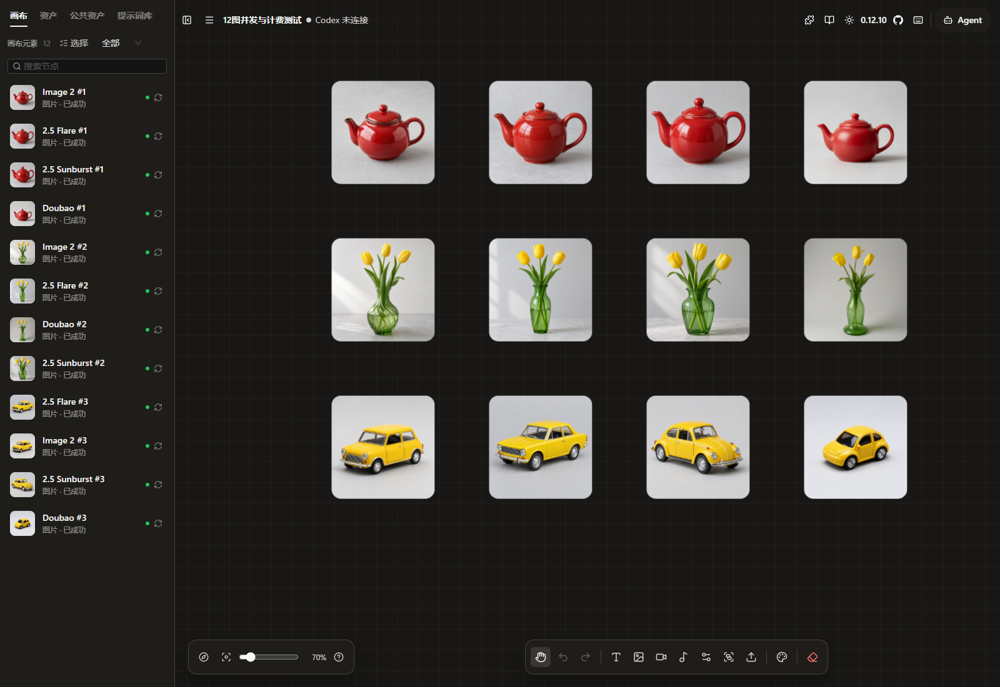

# 工作日志：计费升级、视频交付与图片并发实测

日期：2026-09-12（北京时间）  
项目：HowCanvas / 浩瀚画布  
当日发布：v0.12.9、v0.12.10、v0.12.11  
收尾状态：后端 v0.12.11，前端产物 v0.12.10，图片并发保持 10。

## 今日完成

1. 调研同模型多 API 渠道的调度、故障切换和服务连续性，并核实服务器已有 New API。
2. 发布 v0.12.9，统一图片/视频任务计费，增加视频按实际秒数结算能力、事务资金分录、历史渠道绑定和用户积分明细。
3. 排查生成完成后的视频取回超时，发布 v0.12.10，将单次取回从 2 分钟延长到 10 分钟，补充阶段和真实字节进度。
4. 检查服务器配置、负载、存储、历史任务速度及容量瓶颈，比较下一档服务器的预期收益。
5. 图片并发先从 2 调到 4，再按用户要求发布 v0.12.11，将程序上限与线上配置提高到 10。
6. 按授权使用普通账号进行四模型各三张的真实付费测试，完成队列、计费、并发下载、前端恢复、保存和跨浏览器取图验证。
7. 保持当前 10 槽，不继续扩大付费测试；汇总工作日志、修改记录、验证证据和后续事项到服务器文档区。

## 发布记录

| 上线时间 | 版本与代码提交 | 核心行为 |
| --- | --- | --- |
| 17:31:07 | v0.12.9 / `09b4cf5` | 创建任务预扣一次，成功交付结算；支持视频按秒预扣、实长结算及退差额，账务迁入 SQLite |
| 18:42:11 | v0.12.10 / `7b02420` | 视频单次取回上限 600000ms，底层 HTTP 等待同步调整，前端展示交付阶段和字节进度 |
| 19:10:05 | v0.12.11 / `eaf662e` | 全站图片执行槽由 4 提高到 10；复用前端 v0.12.10 产物 |

上线时间来自各版本服务器 `deployment-receipt.json`。三个版本的代码标签保持原提交；收尾文档作为独立提交同步，本地、GitHub main 与服务器最终源码提交以 `.deployed-commit` 和 `.deployed-manifest.json` 为准，不改写已发布标签。

## 计费与渠道安全

原有“按条价格”及模型覆盖价保持原值。只有管理员明确选择点/秒并设置单价后，才按 15 秒上限预扣；服务器保存视频、核实实际时长后确认实耗并一次退回差额。不能把旧点/条数值直接解释为点/秒。

余额、预扣、累计消费、资金分录和账单事件统一事务处理。创建图片/视频时复用请求标识，重复提交返回原结果，冲突参数拒绝；查询、下载、收图确认不能再次收费。用户从账号菜单或个人页面进入积分明细，服务端按账号隔离。

视频任务绑定创建时的渠道版本和凭据命名空间。旧任务未结束时保留查询依赖，停止新生成不等于删除原渠道；密钥资料保存在受限文件中，不放入公开日志、Git 或前端。图片全部路径的历史渠道适配、未知结果安全恢复仍有后续工作。

v0.12.9 上线前在副本执行迁移与对账，实际可用余额保持一致。历史一笔图片结果不明及其 10 点预扣继续待核实；今天没有借发布自动补偿旧视频重复扣费。测试账号新产生的真实消费属于本轮授权测试，不属于发布导致的余额变化。

## 视频取回与并发

视频由外部 API 生成，服务器负责查询、下载、校验和保存。v0.12.10 把单次下载从 120 秒延长为 600 秒，覆盖跳转、响应头和响应体；浏览器媒体等待同步延长，服务端管理的视频前台轮询窗口约为 60 分钟。

前端区分排队、生成、取回、核验、等待重试和待核实，有文件大小时显示已取回字节及百分比。失败后继续取回原任务，不重新创建生成任务。

本次核实的 Seedance 文件源支持 Range、If-Range 和稳定 ETag，但程序尚未实现断点续传，其他渠道也不能据此视为支持。视频查询/下载/解码仍共享 2 个执行槽；这不表示上游只能同时生成两个视频。两个慢下载可能延迟其他任务的状态查询，查询与媒体处理分池继续列为待办。

## 服务器、代码规模与升级讨论

当前仍为 4 vCPU、约 16GB 内存、220GB 磁盘和固定 14Mbps 公网出口。早期检查可用内存约 9.6GiB、磁盘剩余约 143GB，画布数据约 4.4GiB；这些是检查时快照，备份及测试媒体会继续占用空间。同机还有 New API、数据库、Open WebUI、论坛和工作台等服务。

当前 Git 跟踪的核心源码按物理行统计：`web/src` 的 TS/TSX/CSS 共 180 文件、36,208 行；`server` 的非测试 MJS/Python 共 12 文件、4,146 行，合计约 40,354 行。后端测试另有 9 文件、1,250 行。统计包含空行和注释，不包含依赖、构建产物、文档、其他站点和全部外围脚本，不能作为整个仓库所有文本行数。

讨论的下一档为 8 核、16GB、270GB SSD、18Mbps、3500GB/月，尚未购买或应用。CPU 核数翻倍不意味着外部模型生成翻倍提速；内存没有增加，磁盘增加约 50GB，出口带宽提高约 28.6%，同一文件批次的理想传输时间降低约 22.2%。月流量包主要影响总传输预算，不提高瞬时速度。

早期容量报告按旧 2 槽估算的排队和人数是历史基线，今天 10 槽上线后不再代表当前配置。人数必须区分账号总数、页面在线、持续生成和同时下载；本轮没有证明 10 个独立用户长期重负载的稳定上限。

## 四模型十二图实测

测试在 19:20:25 同时提交 12 个独立任务，19:23:11 全部保存成功。普通账号实际计费，单次均为 `n=1`。Image 2、Flare、Sunburst 走 T8，豆包 Seedream 走火山引擎；未测试 APILIO 的同名渠道。

三组提示词分别是红色茶壶、绿色花瓶与黄色玩具车。前三种模型请求 1024×1024，豆包请求 2048×2048。

| 模型 | 成功 | 三张从提交到保存的耗时 |
| --- | --- | --- |
| gpt-image-2 | 3/3 | 166.6、60.6、77.0 秒 |
| gpt-image-2.5-flare | 3/3 | 27.5、26.4、25.0 秒 |
| gpt-image-2.5-sunburst | 3/3 | 24.8、28.8、53.2 秒 |
| doubao-seedream-5-0-pro-260628 | 3/3 | 51.6、57.1、78.2 秒 |

实际观测到 10 执行、2 排队，两项分别排队约 24.7、25.0 秒。任意任务结束即释放槽位，没有等待整批完成才启动下一批。整批 166.6 秒的耗时不包含用户端下载和绘制。

整机 CPU 平均约 29.5%、采样峰值 54.5%；可用内存最低约 9.59GiB，后端 RSS 峰值约 119.6MiB。本机经生产网关的 80 次健康请求全部成功，中位 2ms、最大 20ms；这不是公网用户端延迟。约两秒一次的采样可能漏掉更短峰值。

## 计费与前端交付验证

12 个任务产生 12 条账单，每条只有一次预扣及一次确认；预扣全部转为已结算，资金分录和可用余额相符。以相同请求编号重放 12 次，任务与账单均未增加；同编号更改提示词返回 409。36 次结果读取、24 次缓存确认以及后续真实浏览器恢复均未额外扣费。账号具体余额和交易明细仅保存于服务器受限验证归档。

12 路从正式媒体 API 同时下载到本地 Windows，共 25.94MB，耗时 14.92 秒，平均 13.91Mbps；通过 SSH 隧道保护会话，实际占用服务器公网出口。12 张字节数、SHA-256 和解码全部通过。

新增一张「12图并发与计费测试」画布，挂接原任务，由真实 Edge 浏览器执行取图、校验、缓存、绘制回执、画布媒体同步和保存；未重新生成。原有画布核对保持一致。

| 前端环节 | 结果 |
| --- | --- |
| 首次恢复已有任务 | 12 张全部显示，约 53.6 秒 |
| 同浏览器刷新 | 12 张全部显示，约 1.1 秒 |
| 无缓存的新浏览器恢复 | 12 张全部显示，约 35.4 秒 |
| 服务端证据 | 12 份画布媒体哈希一致，12 个成功节点，12 条真实绘制回执 |
| 浏览器执行 | 无捕获到的页面脚本异常，新增生成请求为 0 |

前端时间从 DOM 就绪开始，不含此前导航；它与纯并发下载计时不同。此轮补齐的是原任务恢复交付链路，不是十台浏览器同时操作，也没有重复支付以重跑首次点击生成。

测试画布：[12图并发与计费测试](http://can.hoosland.com/canvas/loadtest-12-images-20260912)，需要对应账号权限。

## 多渠道方案与收尾决定

早期调研比较画布内调度、New API、LiteLLM 和入口负载均衡。后续服务器检查确认已有 New API，因此无需为此再部署第二套；可以先评估接入现有内部网关。画布继续负责业务任务、账号计费、媒体和原任务恢复，网关负责可验证的渠道分配。

同模型名称不保证能力等价；图片编辑字段、质量和尺寸、视频任务查询命名空间、重试是否重复受理都必须逐渠道验证。上游结果不明时不能盲目换渠道重新生成。渠道容错与多实例高可用是不同目标，全部服务仍在同一主机时不能消除单机故障。

截至收尾，多渠道自动池化、自动切换和多实例高可用尚未实施。图片并发保持 10，视频取回/校验保持 2。CPU 和内存为后续探索 12–16 路提供了空间，但出口已接近饱和，用户要求先维持现状。

## 文档、归档和待办

服务器文档区为 `/opt/infinite-canvas/docs/`，本日志和[修改记录](CHANGE_ARCHIVE_2026-09-12_CANVAS.md)随独立文档提交同步。文档同步不编译、不构建、不重启应用；保留同日已有的独立项目文档。

三个发布备份分别位于 `/opt/hoosland-archive/canvas-history-v0.12.9-20260912/`、`canvas-history-v0.12.10-20260912/`、`canvas-history-v0.12.11-20260912/`。压测、原图、提示词、资金核对和浏览器证据位于 `/opt/hoosland-archive/canvas-image-loadtest-20260912/`；目录受限，不把账户详细资料加入公开 Git。

后续：HTTPS、安全 Cookie、静态资源压缩与缓存、预览图或对象存储/CDN、用户公平队列、渠道额度、视频查询与下载分池、断点续传、旧账核实、失败/取消退款及持续多用户压测。当前全部成功的图片样本不能证明异常退款或视频并发已通过。

关联文档：[计费与台账](GENERATION_BILLING.md)、[并发配置和实测](CONCURRENCY_SETTINGS.md)、[多渠道升级方案](MULTI_CHANNEL_ROUTING_UPGRADE.md)、[v0.12.9](../RELEASE_NOTES_v0.12.9.md)、[v0.12.10](../RELEASE_NOTES_v0.12.10.md)、[v0.12.11](../RELEASE_NOTES_v0.12.11.md)。
